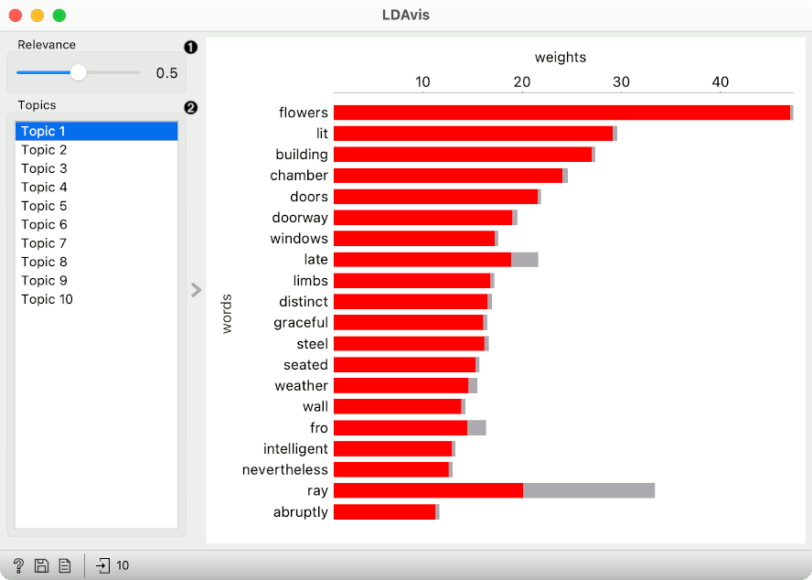
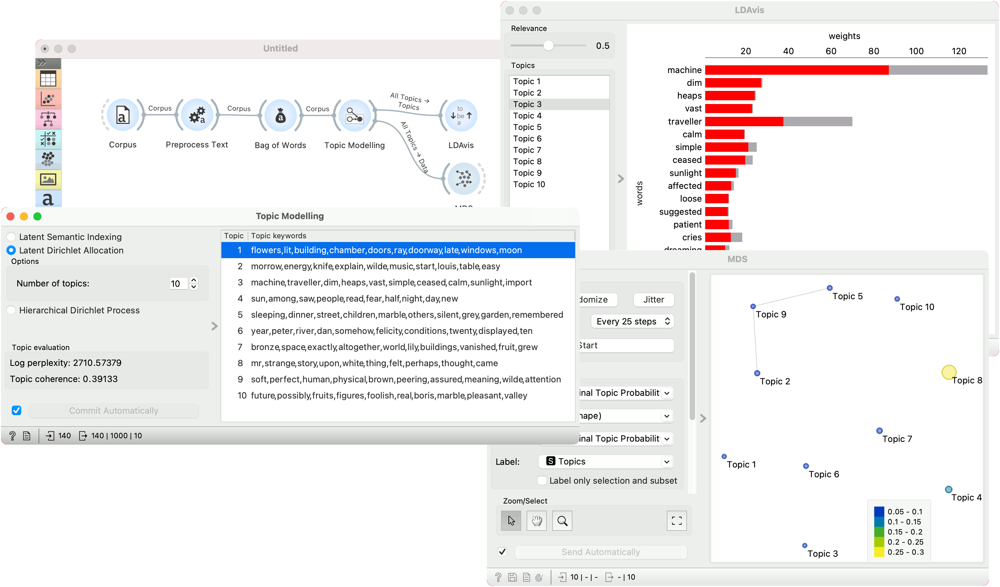

LDAvis
======

Interactive exploration of LDA topics.

**Inputs**

- Topics: All LDA topics from topic modeling.

**LDAvis** is an Orange implementation of pyLDAvis, which is further derived from an R package LDAvis by Sievert and Shirely (2014). The visualization is designed for the exploration of LDA topic models by adjusting the weights of top ranked topic words. Parameter Relevance adjusts word weights and it can be between 0 and 1, where 1 represents the words ranked solely by their topic frequency, and 0 those ranked solely by their lift (ratio of the probability of the word in a topic to the probability of thw word in the corpus).

1. Parameter for adjusting the word's relevance in the topic. 1 would show words as seen in the Topic Modeling widget.
2. List of topics.

The plot on the right shows the top 20 words as ranked by the computed relevance. The default relevance is 0.5, which strikes a good balance between in-topic probability and lift (the authors suggest 0.6). The weights (x axis) show absolute word counts. The red bar shows in-topic probability, while the gray bar shows the in-corpus probability of a given word.

Example
-------

We show how to approximate the exact LDAvis in Orange. We are using *book-excerpts.tab* corpus in the example, which we load with [Corpus](corpus-widget.md), pass it to [Preprocess Text](preprocesstext.md), then to [Bag of Words](bagofwords-widget.md) and finally to [Topic Modelling](topicmodelling-widget.md), where we compute 10 topics with the LDA method.

Next, we pass the *All Topics* output to **LDAvis** and to **MDS**. LDAvis shows the top ranked words for Topic 3, which seems to describe an industrial realm. One can adjust the Relevance slider to interactively explore word rankings.

In MDS, we have set the color and size of the point to *Marginal Topic Probability* and labelled the point with their topic names. This represent the left part of LDAvis visualization, namely the PCA-based MDS projection of topic similarity and their corresponding weights in the corpus. It seems that Topic 8 is the most frequent topic in the corpus.

References
----------

Sievert, Carson  and Kenneth Shirley (2014). LDAvis: A method for visualizing and interpreting topics. In Proceedings of the Workshop on Interactive Language Learning, Visualization, and Interfaces. [Available online.](https://aclanthology.org/W14-3110)
