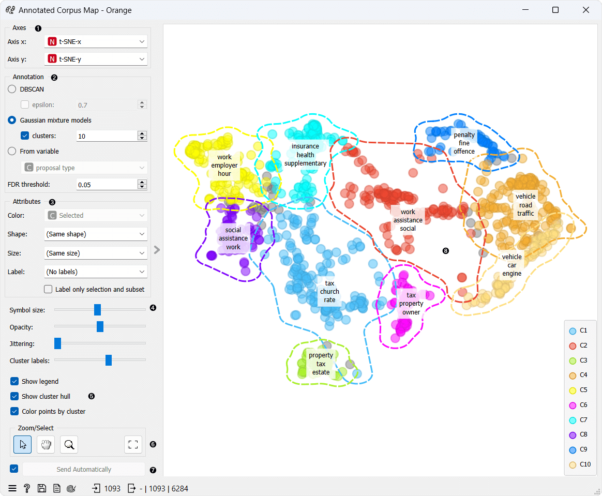
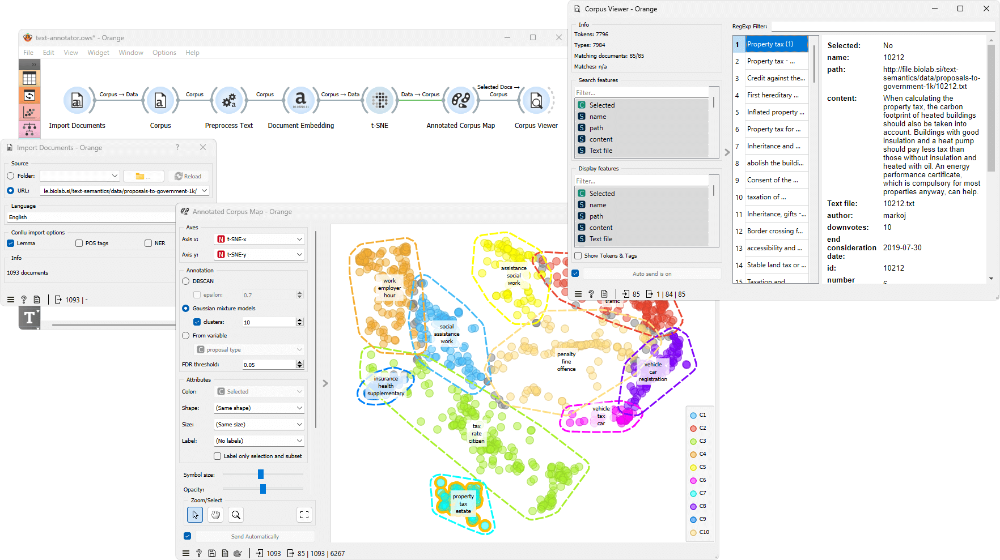

Annotated Corpus Map
===============

Annotates projection clusters.

**Inputs**

- Corpus: A collection of documents.

**Outputs**

- Corpus: Corpus with clusters appended.
- Scores: Scores and p-values per cluster.

**Annotated Corpus Map** receives corpus data with a mapping to a two-dimensional space. It then identifies clusters on the map and annotates them with keywords representing a cluster.

1. *Axis X* and *Axis Y* let you select attributes you will show in the widget. By default t-SNE-x and t-SNE-y are selected which are transformations to lower dimensional space with a method named t-SNE.
2. For the clustering, the choices are:
   - *[DBSCAN](https://en.wikipedia.org/wiki/DBSCAN)* algorithm groups data based on density, suitable for various cluster shapes and sizes. Epsilon is the radius that defines a data point's neighborhood.
   - *[Gaussian Mixture Models](https://en.wikipedia.org/wiki/Mixture_model#Gaussian_mixture_model)* probabilistically cluster data. The number of clusters is by default set to the number of clusters with maximal silhouette but can be changed manually.
   - *By variable* is enabled only if the data contains a discrete attribute, possibly in meta variables.
3. Set the color of the displayed points. Set shape, size and label to differentiate between points. If *Label only selection and subset* is ticked, only selected and/or highlighted points will be labelled.
4. Set symbol size and opacity for all data points. Set [jittering](https://en.wikipedia.org/wiki/Jitter) to prevent the dots overlapping. Set the number of labels shown for a cluster - select up to five characteristic words to be displayed for each cluster (default is three).
5. Adjust *plot properties*:
   - *Show legend* displays a legend on the right. Click and drag the legend to move it.
   - *Show cluster hull* regulate whether the hull around cluster is present or not.
   - *Color points by cluster* colors the points with cluster specific color. When this option is checked setting color in box 2 is disabled.
6. *Select, zoom, pan, and zoom to fit* are the options for exploring the graph. The manual selection of data instances works as an angular/square selection tool. Double click to move the projection. Scroll in or out for zoom.
7. If *Send Automatically*, changes are communicated automatically. Alternatively press *Send*.
8. The main view shows you data clustered data items. Each cluster is surrounded by a hull and has assigned characteristic words representing a cluster. Hovering over the cluster labels displays a tooltip with scores and up to ten characteristic words.

Example
-------

Annotated Corpus Map is used to find characteristic terms from the documents. In the example below, we are importing [government proposal](https://file.biolab.si/text-semantics/data/proposals-to-government-1k/) text documents with the [Import Documents](importdocuments.md) widget to the [Corpus](corpus-widget.md) widget.

We pass the corpus to [Preprocess Text](preprocesstext.md), where we lowercase the text, split it into words with tokenization, use Lemmagen lemmatizer to cover tokens to their base form and finally remove stopwords and numbers. Next, we embed documents in vector space using the [Document Embedding](documentembedding.md) widget and project the data into two dimensions with t-SNE widget.

Finally, we pass the data to Annotated Corpus Map. The widget identifies clusters on the map and annotates them with keywords representing a cluster. We can select a cluster and see the texts with [Corpus Viewer](corpusviewer.md) widget.

