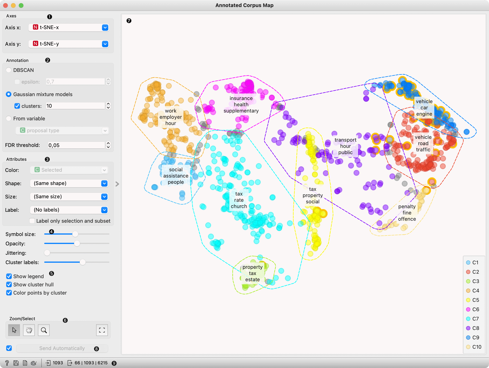
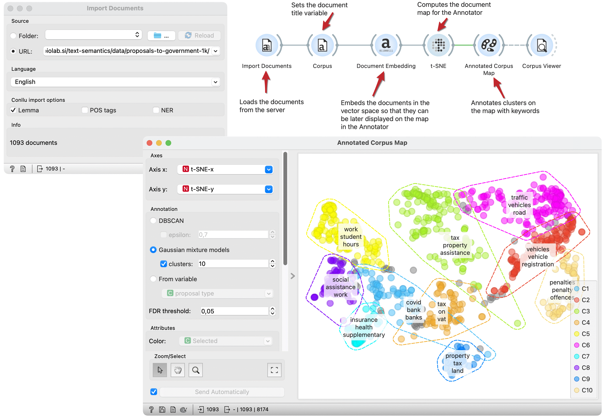

Annotated Corpus Map
====================

Annotated Corpus Map visualises, cluster annotates documents with keywords in 
two-dimensional plot.

**Inputs**

- Corpus: A collection of documents to visualise.

**Outputs**

- Selected Document: Documents selected from the plot
- Corpus: Data with an additional column showing whether a document is selected and information about the cluster the document belongs to
- Scores: Table with scores and p-values for each keyword averaged per cluster

The **Annotated Corpus Map** widget provides a 2-dimensional scatter plot visualization 
of the document. The documents are displayed as a collection of points, each having 
the value of the x-axis attribute determining the position on the horizontal axis 
and the value of the y-axis attribute determining the position on the vertical axis. 
Widget clusters documents according to annotation settings and assigns keywords to 
each cluster. Keywords are extracted with the TF-IDF method.

1. **Axes**: Select the x and y attribute. We suggest using the t-SNE widget before 
   Annotator and selecting `t-SNE-x` and `t-SNE-y` as x and y attributes.
2. **Annotation**: Select the method to identify clusters:
   - *[DBSCAN](https://orange3.readthedocs.io/projects/orange-visual-programming/en/latest/widgets/unsupervised/DBSCAN.html) clustering*: 
     Set epsilon, the maximum distance between two samples for one to be considered 
     as in the neighbourhood of the other and those clustered together. Unchecking 
     epsilon will instruct the widget to set epsilon automatically.
   - *[Gaussian mixture models](https://scikit-learn.org/stable/modules/mixture.html#gaussian-mixture)*: 
     Select the number of desired clusters. Unchecking clusters will instruct the widget 
     to set the numbers of clusters automatically.
   - *From variable* clusters documents according to a selected categorical variable.
   
   FDR Threshold sets the threshold for selecting a keyword as a cluster's keyword. 
   Keywords with corrected p-value (FDR) from the hypergeometric test lower than 
   the threshold are selected.
3. **Attributes**: Set the colour of the displayed points (you will get colours 
   for categorical values and blue-green-yellow points for numeric). Set label, 
   shape and size to differentiate between points. *Label only selected points* 
   allows you to select individual data instances and label only those.
4. Set symbol size and opacity for all data points. Set [jittering](https://en.wikipedia.org/wiki/Jitter) 
   to prevent the dots from overlapping. Jittering will randomly scatter points 
   only around categorical values. *Cluster labels* define how many keywords per 
   cluster widget will show.
5. Set additional plot settings:
   - *Show legend* displays a legend.
   - *Show cluster hull* displays the concave hull around clusters.
   - *Color points by cluster* colours documents (points) by the cluster they belong to. 
     If unchecked *Color* attribute is used for colouring.
6. *Select, zoom, pan and zoom to fit* are the options for exploring the graph. 
   The manual selection of data instances works as an angular/square selection tool. 
   Double-click to move the projection. Scroll in or out for zoom.
7. Plot with each point presenting documents. Documents are clustered according to 
   the settings above, and clusters are marked with a hull. Over each cluster, 
   the widget places the list of the most significant keywords.
8. Changes are communicated automatically if *Send automatically* is ticked. 
   Alternatively, press *Send*.
9. Get hel, save the plot, add the plot to the report, set visual settings and get input 
   and output information.

Example
-------

Documents maps can be enhanced with keyword annotations. This workflow embeds documents 
in vector space, computes and annotates a t-SNE document map. The Annotator widget 
identifies clusters on the map and annotates them with keywords representing a cluster.

We load the **Proposal to government** dataset from 
[documents repository](https://file.biolab.si/text-semantics/data/proposals-to-government-1k/) 
with the **Import Documents** widget. In the **Corpus** widget, we set variables used 
as text features and the title variable for display purposes.

The **Docuemnt Embedding** widget embeds documents in the vector space for the 
**t-SNE** widget to project them in two-dimensional space. 

**Annotated Corpus Map** plots documents on the two-dimensional space. 
We select t-SNE projection as the x and y variables. 
And decide to use Gaussian mixture models for cluster identification. 
The widget marks clusters with hulls and places keywords on each cluster. 

We got clusters with different topics. In the left purple cluster, 
we have documents connected to traffic, while the red cluster seems similar but 
more focused on vehicles and registration. The yellow cluster includes documents 
related to work and students.

We can select a subset of documents of interest and observer them in the **Corpus Viewer** 
widget connected to the output.

