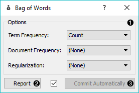
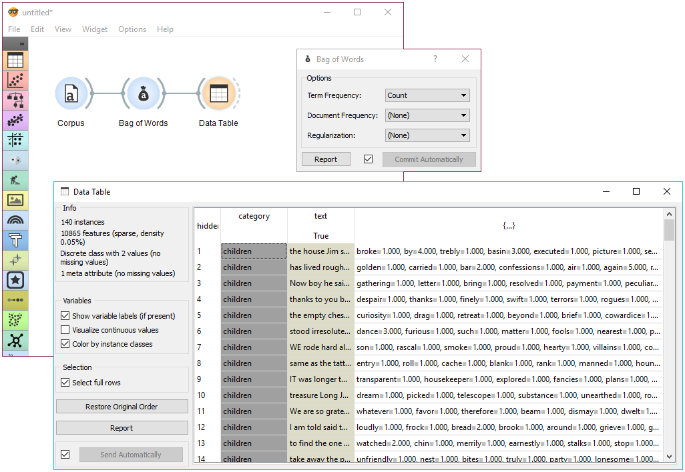
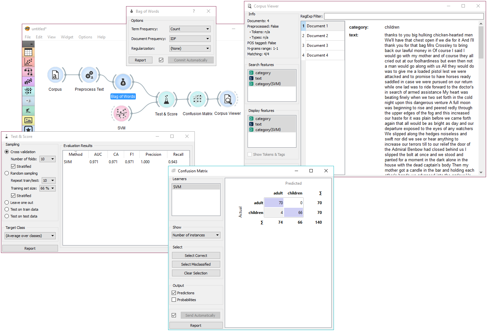

Bag of Words
============

Generates a bag of words from the input corpus.

**Inputs**

- Corpus: A collection of documents.

**Outputs**

- Corpus: Corpus with bag of words features appended.

**Bag of Words** model creates a corpus with word counts for each data instance (document). The count can be either absolute, binary (contains or does not contain) or sublinear (logarithm of the term frequency). Bag of words model is required in combination with [Word Enrichment](wordenrichment.md) and could be used for predictive modelling.

1. Parameters for [bag of words](https://en.wikipedia.org/wiki/Tf%E2%80%93idf) model:
    - Term Frequency:
        - Count: number of occurrences of a word in a document
        - Binary: word appears or does not appear in the document
        - Sublinear: logarithm of term frequency (count)
    - Document Frequency:
        - (None)
        - IDF: [inverse document frequency](http://nlp.stanford.edu/IR-book/html/htmledition/inverse-document-frequency-1.html)
        - [Smooth IDF](http://scikit-learn.org/stable/modules/generated/sklearn.feature_extraction.text.TfidfTransformer.html): adds one to document frequencies to prevent zero division.
    - Regulariation:
        - (None)
        - L1 (Sum of elements): normalizes vector length to sum of elements
        - L2 (Euclidean): normalizes vector length to sum of squares
2. Produce a report.
3. If *Commit Automatically* is on, changes are communicated automatically. Alternatively press *Commit*.

Example
-------

In the first example we will simply check how the bag of words model looks like. Load *book-excerpts.tab* with [Corpus](corpus-widget.md) widget and connect it to **Bag of Words**. Here we kept the defaults - a simple count of term frequencies. Check what the **Bag of Words** outputs with **Data Table**. The final column in white represents term frequencies for each document.

In the second example we will try to predict document category. We are still using the *book-excerpts.tab* data set, which we sent through [Preprocess Text](preprocesstext.md) with default parameters. Then we connected **Preprocess Text** to **Bag of Words** to obtain term frequencies by which we will compute the model.

Connect **Bag of Words** to **Test & Score** for predictive modelling. Connect **SVM** or any other classifier to **Test & Score** as well (both on the left side). **Test & Score** will now compute performance scores for each learner on the input. Here we got quite impressive results with SVM. Now we can check, where the model made a mistake.

Add **Confusion Matrix** to **Test & Score**. Confusion matrix displays correctly and incorrectly classified documents. *Select Misclassified* will output misclassified documents, which we can further inspect with [Corpus Viewer](corpusviewer.md).
