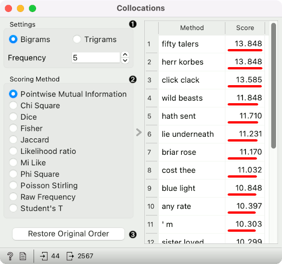
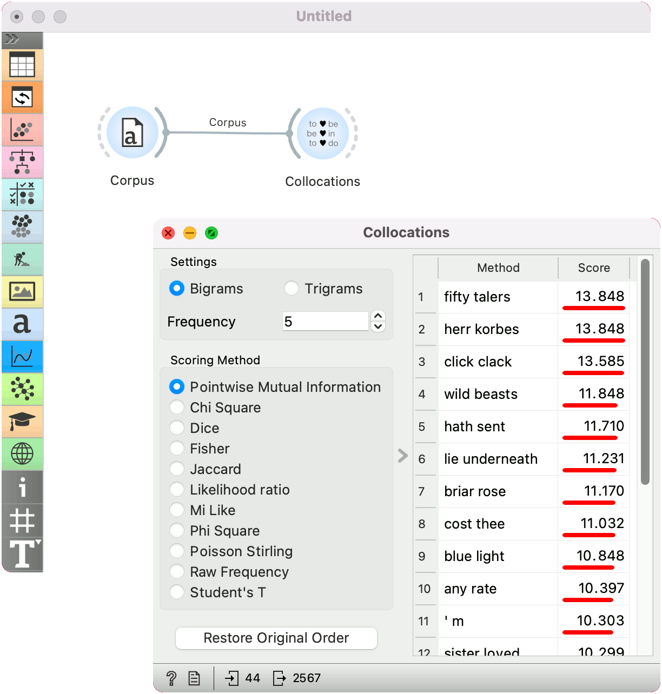

Collocations
============

Compute significant bigrams and trigrams.

**Inputs**

- Corpus: A collection of documents.

**Outputs**

- Table: A list of bigrams or trigrams.

**Collocations** finds frequently co-occurring words in a corpus. It displays bigrams or trigrams by the score.

1. Settings: observe bigrams (sets of two co-occurring words) or trigrams (sets of three co-occurring words). Set the frequency threshold (remove n-grams with frequency lower than the threshold).
2. Scoring method:
   - [Pointwise Mutual Information](https://en.wikipedia.org/wiki/Pointwise_mutual_information) (PMI)
   - [Chi Square](https://en.wikipedia.org/wiki/Chi-squared_test)
   - [Dice](https://en.wikipedia.org/wiki/S%C3%B8rensen%E2%80%93Dice_coefficient)
   - [Fisher](https://en.wikipedia.org/wiki/Fisher%27s_method)
   - [Jaccard](https://en.wikipedia.org/wiki/Jaccard_index)
   - [Likelihood ratio](https://en.wikipedia.org/wiki/Likelihood-ratio_test)
   - Mi Like
   - [Phi Square](https://en.wikipedia.org/wiki/Phi_coefficient)
   - Poisson Stirling
   - Raw Frequency
   - [Student's T](https://en.wikipedia.org/wiki/Student%27s_t-test)

Example
-------

**Collocations** is mostly intended for data exploration. Here, we show how to observe bigrams that occur more than five times in the corpus. Bigrams are computed using the Pointwise Mutual Information statistics.

We use the *grimm-tales-selected* data in the [Corpus](corpus-widget.md) and send the data to Collocations.

References
----------

Manning, Christopher, and Hinrich Schütze. 1999. Collocations. Available at: https://nlp.stanford.edu/fsnlp/promo/colloc.pdf
