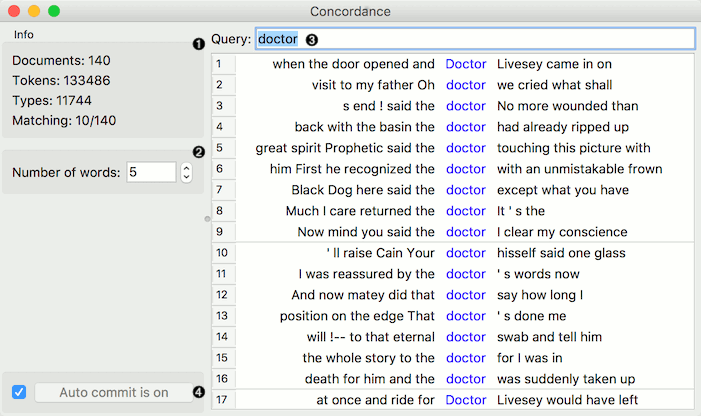
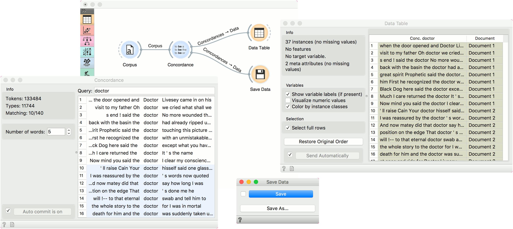

Concordance
===========

Display the context of the word.

**Inputs**

- Corpus: A collection of documents.

**Outputs**

- Selected Documents: Documents containing the queried word.
- Concordances: A table of concordances.

**Concordance** finds the queried word in a text and displays the context in which this word is used. Results in a single color come from the same document. The widget can output selected documents for further analysis or a table of concordances for the queried word. Note that the widget finds only exact matches of a word, which means that if you query the word 'do', the word 'doctor' won't appear in the results.

1. *Information*:
   - *Documents*: number of documents on the input.
   - *Tokens*: number of tokens on the input.
   - *Types*: number of unique tokens on the input.
   - *Matching*: number of documents containing the queried word.
2. *Number of words*: the number of words displayed on each side of the queried word.
3. Queried word.
4. If *Auto commit is on*, selected documents are communicated automatically. Alternatively press *Commit*.

Examples
--------

*Concordance* can be used for displaying word contexts in a corpus. First, we load *book-excerpts.tab* in [Corpus](corpus-widget.md). Then we connect **Corpus** to **Concordance** and search for concordances of a word 'doctor'. The widget displays all documents containing the word 'doctor' together with their surrounding (contextual) words.

Now we can select those documents that contain interesting contexts and output them to [Corpus Viewer](corpusviewer.md) to inspect them further.

In the second example, we will output concordances instead. We will keep the *book-excerpts.tab* in [Corpus](corpus-widget.md) and the connection to **Concordance**. Our queried word remains 'doctor'.

This time, we will connect **Data Table** to **Concordance** and select Concordances output instead. In the **Data Table**, we get a list of concordances for the queried word and the corresponding documents. Now, we will save this table with **Save Data** widget, so we can use it in other projects or for further analysis.

