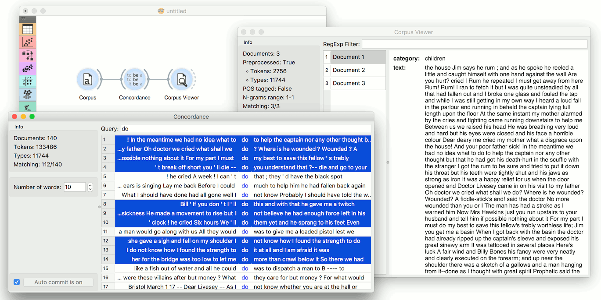

===========
Concordance
===========

Display the context of the word.

Signals
-------

**Inputs**:

-  **Corpus**

   A :ref:`Corpus` instance.

**Outputs**:

-  **Selected Documents**

   A :ref:`Corpus` instance.   

Description
-----------

**Concordance** finds the queried word in a text and displays the context in which this word is used. It can output selected documents for further analysis.

.. figure:: images/Concordance-stamped.png

1. *Information*:
	- *Documents*: number of documents on the input.
	- *Tokens*: number of tokens on the input.
	- *Types*: number of unique tokens on the input.
	- *Matching*: number of documents containing the queried word.
2. *Number of words*: the number of words displayed on each side of the queried word.
3. Queried word.
4. If *Auto commit is on*, selected documents are communicated automatically. Alternatively press *Commit*.

Example
-------

*Concordance* can be used for displaying word contexts in a corpus. First, we load *bookexcerpts.tab* in :doc:`Corpus <corpus>`. Then we connect **Corpus** to **Concordances** and search for concordances of a word "doctor". The widget displays all documents containing the word "doctor" together with their surrounding (contextual) words. Note that the widget finds only exact matches of a word.

Now we can select those documents that contain interesting contexts and output them to :doc:`Corpus Viewer <corpusviewer>` to inspect them further.

