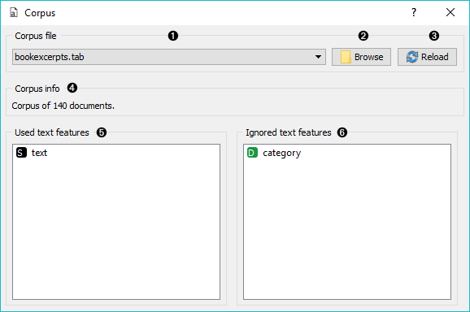
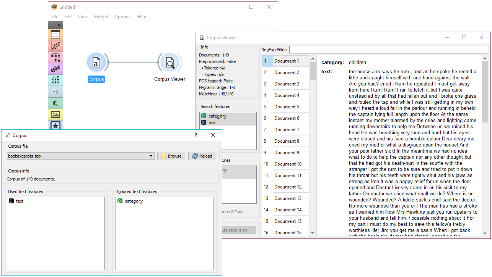
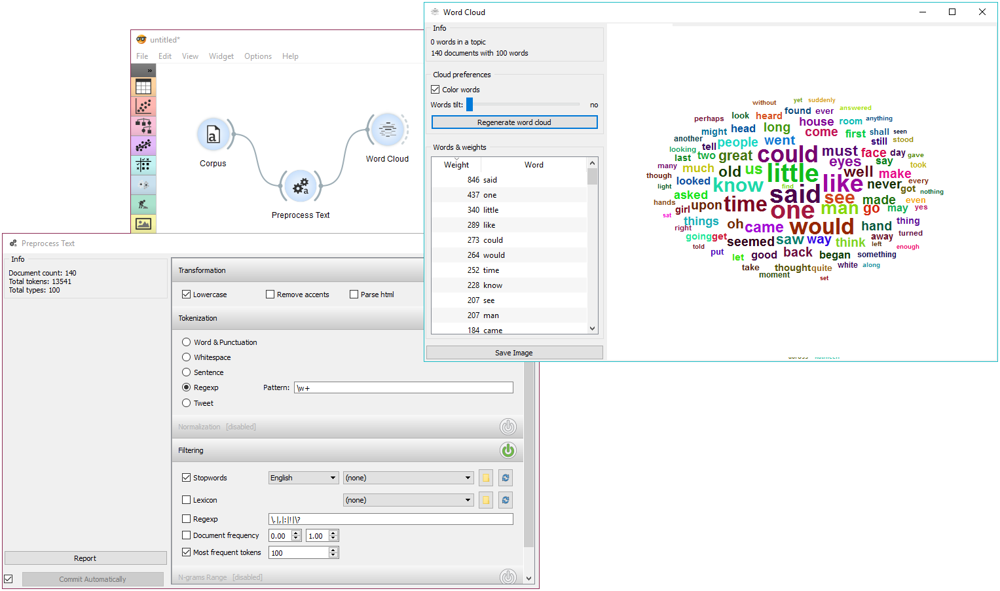

Corpus
======

Load a corpus of text documents, (optionally) tagged with categories, or change the data input signal to the corpus.

**Inputs**

- Data: Input data (optional)

**Outputs**

- Corpus: A collection of documents.

**Corpus** widget can work in two modes:

- When no data on input, it reads text corpora from files and sends a corpus instance to its output channel. History of the most recently opened files is maintained in the widget. The widget also includes a directory with sample corpora that come pre-installed with the add-on.
    The widget reads data from Excel (**.xlsx**), comma-separated (**.csv**) and native tab-delimited (**.tab**) files.
- When the user provides data to the input, it transforms data into the corpus. Users can select which features are used as text features.

1. Browse through previously opened data files, or load any of the sample ones.
2. Browse for a data file.
3. Reloads currently selected data file.
4. Select the variable that is shown as a document title in Corpus Viewer.
5. Features that will be used in text analysis.
6. Features that won't be used in text analysis.
7. Browse through the datasets that come together with an add-on.
8. Access help, make a report and get information on the loaded data set.

You can drag and drop features between the two boxes and also change the order in which they appear.

Example
-------

The first example shows a very simple use of **Corpus** widget. Place **Corpus** onto canvas and connect it to [Corpus Viewer](corpusviewer.md). We've used *book-excerpts.tab* data set, which comes with the add-on, and inspected it in **Corpus Viewer**.

The second example demonstrates how to quickly visualize your corpus with [Word Cloud](wordcloud.md). We could connect **Word Cloud** directly to **Corpus**, but instead, we decided to apply some preprocessing
with [Preprocess Text](preprocesstext.md). We are again working with *book-excerpts.tab*. We've put all text to lowercase, tokenized (split) the text to words only, filtered out English stopwords and selected 100 most frequent tokens.

