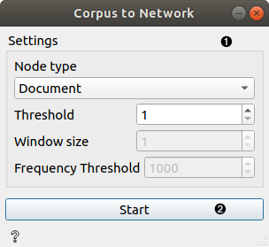
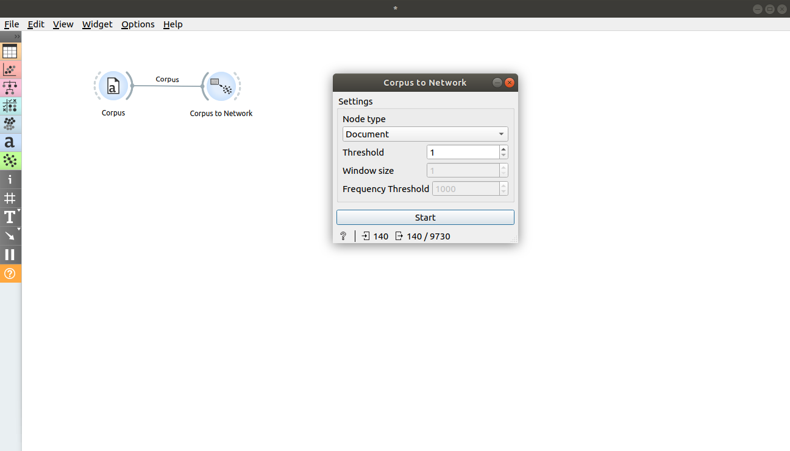
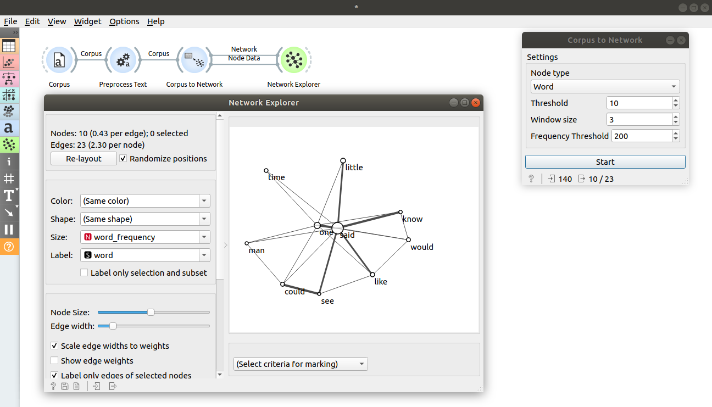
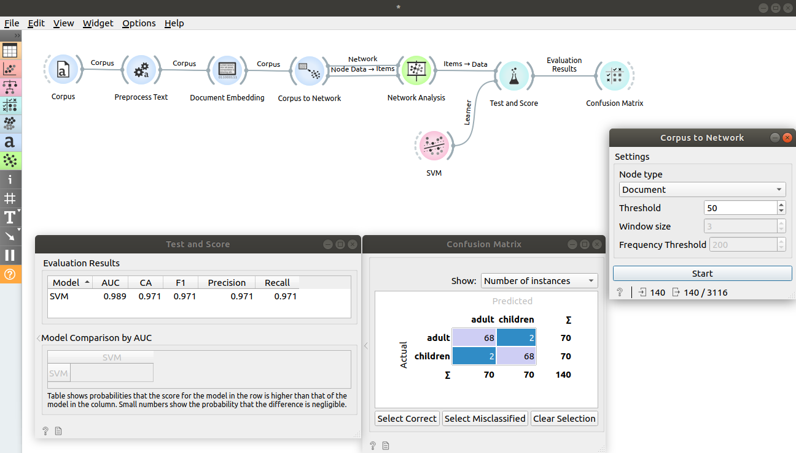

Corpus to Network
=================

Creates a network from given corpus. Network nodes can be either documents or words (ngrams). 

**Inputs**

- Corpus: A collection of documents.

**Outputs**

- Network: A network generated from input corpus.
- Node data: Additional data about nodes.

**Corpus to Network** can operate either on documents or words (ngrams). If nodes are documents, there's an edge between two documents if number of words (ngrams) that appears in both documents is at least *Threshold*. If nodes are words (ngrams), there's an edge between two words if the number of times they both appear inside of a window (of size 2 * *Window size* + 1) is at least *Threshold*. Only words that have frequency higher than *Frequency Threshold* will be included as nodes. This is a word [co-occurrence network](https://en.wikipedia.org/wiki/Co-occurrence_network).

1. Widget parameters:
    - Node type: controls whether nodes will be documents or words (ngrams)
    - Threshold: controls threshold needed for defining the edge between two nodes (see explanation above)
    - Window size: controls window size (see explanation above), applicable only if Node type is set to Word
    - Frequency Threshold: controls threshold for word frequency (see explanation above), applicable only if Node type is set to Word
2. Button for starting computation after stopping it or changing parameters while the widget is running. If clicked, it is replaced with Stop button.

Examples
--------

In first example, we will inspect how the widget works.  Load *book-excerpts.tab* using [Corpus](corpus-widget.md) widget and connect it to **Corpus to Network**. We see that the input contains 140 documents and the output is network with 140 nodes and 9730 edges. This is a complete graph, which is expected because the *Threshold* parameter is set to 1 (it is expected that each document shares at least 1 word). Change it a little to see how the number of edges changes. 

Let's now create a word co-occurrence network and visualize it. Load *book-excerpts.tab* using [Corpus](corpus-widget.md) widget, connect it to [Preprocess Text](preprocesstext.md) with default parameters and connect **Preprocess Text** to **Corpus to Network**. Set *Node type* to Word, *Threshold* to 10, *Window size* to 3 and *Frequency Threshold* to 200 and press Start. The output network now contains only words (ngrams) with frequency over 200. The edges between those words are created if the words co-occur in at least 10 windows of width 7 (2 * *Window size* + 1). Connect **Corpus to Network** widget to **Network Explorer**, double click on a connection between them and connect Node data to Node data. Now open the **Network Explorer** widget, set Label to word to annotate the nodes and Size to word_frequency to make node sizes correspond to their frequencies. We get a nice visualization of most frequent words in corpus and their connections.

In [Document Embedding](documentembedding.md) widget, we saw how we can predict document category using it. Let's now try to improve the score even further by adding features obtained from network. We will keep working on *book-excerpts.tab* loaded with [Corpus](corpus-widget.md) widget and sent through [Preprocess Text](preprocesstext.md) with default parameters. Connect **Preprocess Text** to **Document Embedding** to obtain features for predictive modelling. Here we set aggregator to Sum.

The first part was the same. Let's now obtain some features from network. Connect **Document Embedding** widget to **Corpus to Network**, set *Node type* to Document, *Threshold* to 50 and press Start. Connect **Corpus to Network** to **Network Analysis** widget. Double click on the connection and connect Node data to Items so that the output data contains previously obtained embedding features. Open **Network Analysis** widget and uncheck everything under the Graph-level indices tab and check everything under the Node-level indices tab. You can connect **Data Table** widget to inspect the output.

Now connect **Network Analysis** widget to **Test and Score** and also connect learner of choice to the left side of **Test and Score**. We chose SVM and changed kernel to Linear. **Test and Score** will now compute performance of each learner on the input. We can see that we obtained even better results by adding network features. Let's connect **Test and Score** to **Confusion Matrix**. New features helped us correctly classify two more examples.

