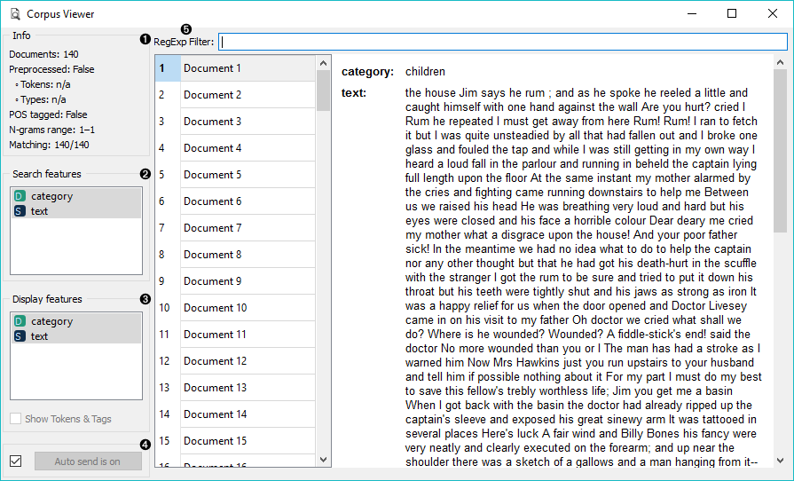
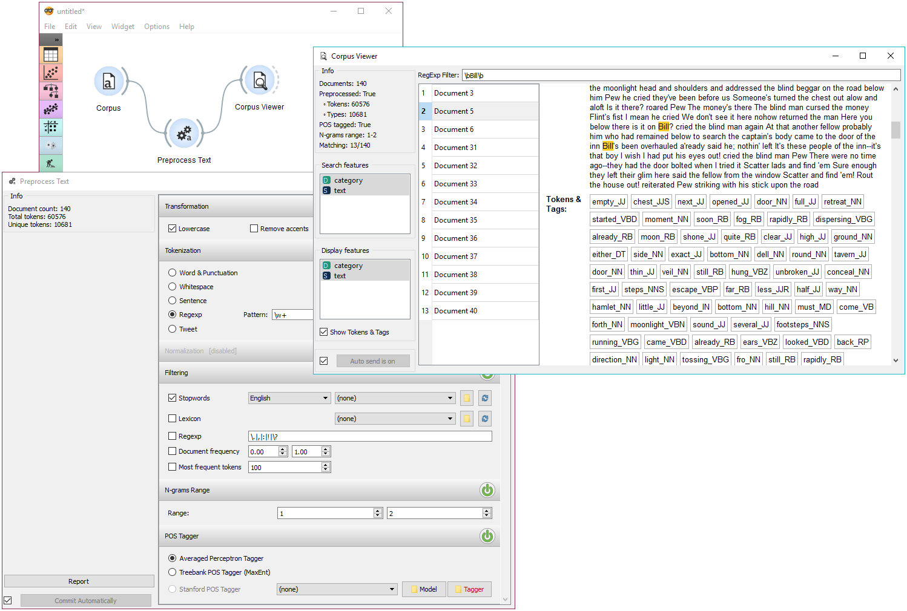

Corpus Viewer
=============

Displays corpus content.

**Inputs**

- Corpus: A collection of documents.

**Outputs**

- Corpus: Documents containing the queried word.

**Corpus Viewer** is meant for viewing text files (instances of Corpus). It will always output an instance of corpus. If *RegExp* filtering is used, the widget will output only matching documents.

1. *Information*:
   - *Documents*: number of documents on the input
   - *Preprocessed*: if preprocessor is used, the result is True, else False. Reports also on the number of tokens and types (unique tokens).
   - *POS tagged*: if POS tags are on the input, the result is True, else False.
   - *N-grams range*: if N-grams are set in [Preprocess Text](preprocesstext.md), results are reported, default is 1-1 (one-grams).
   - *Matching*: number of documents matching the *RegExp Filter*. All documents are output by default.
2. *RegExp Filter*: [Python regular expression](https://docs.python.org/3/library/re.html) for filtering documents. By default no documents are filtered (entire corpus is on the output).
3. *Search Features*: features by which the RegExp Filter is filtering. Use Ctrl (Cmd) to select multiple features.
4. *Display Features*: features that are displayed in the viewer. Use Ctrl (Cmd) to select multiple features.
5. *Show Tokens & Tags*: if tokens and POS tag are present on the input, you can check this box to display them.
6. If *Auto commit is on*, changes are communicated automatically. Alternatively press *Commit*.

Example
-------

*Corpus Viewer* can be used for displaying all or some documents in corpus. In this example, we will first load *book-excerpts.tab*, that already comes with the add-on, into [Corpus](corpus-widget.md) widget. Then we will preprocess the text into words, filter out the stopwords, create bi-grams and add POS tags (more on preprocessing in [Preprocess Text](preprocesstext.md). Now we want to see the results of preprocessing. In *Corpus Viewer* we can see, how many unique tokens we got and what they are (tick *Show Tokens & Tags*). Since we used also POS tagger to show part-of-speech labels, they will be displayed alongside tokens underneath the text.

Now we will filter out just the documents talking about a character Bill. We use regular expression *\\bBill\\b* to find the documents containing only the word Bill. You can output matching or non-matching documents, view them in another *Corpus Viewer* or further analyse them.

