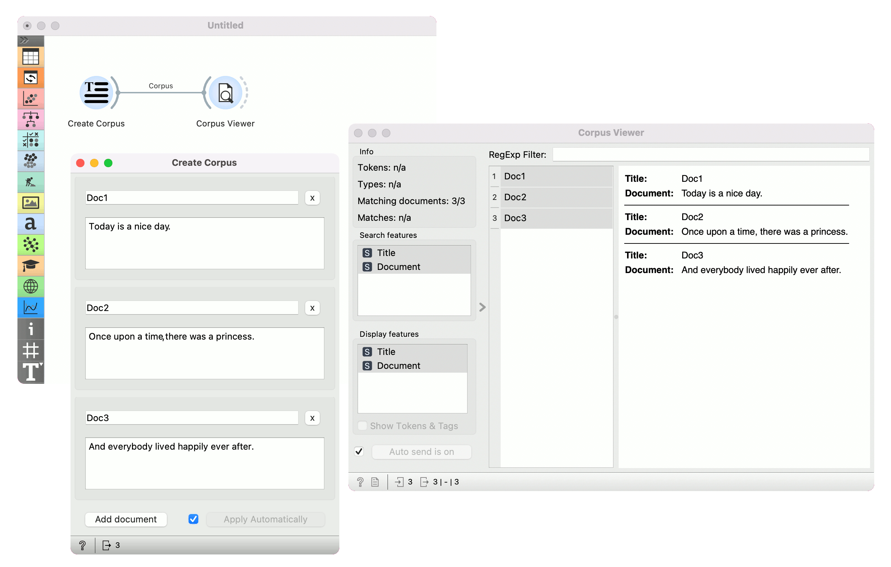

Create Corpus
=============

Write/paste documents to create a corpus

**Outputs**

- Corpus: The created corpus.

**Create Corpus** is a widget for quick creation of a sample of documents. It enables manual entry or copy-pasting content from clipboard. The widget would typically be used in an educational setting or for predicting a sample of documents.

1. The title of the document.
2. Remove a document.
3. Enter the content of the document.
4. Add a new document.

Example
-------

In this simple example we entered three new documents in the **Create Corpus** widget and sent them to [Corpus Viewer](corpusviewer.md) to display them.

