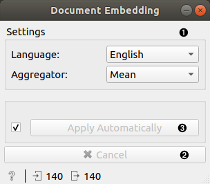
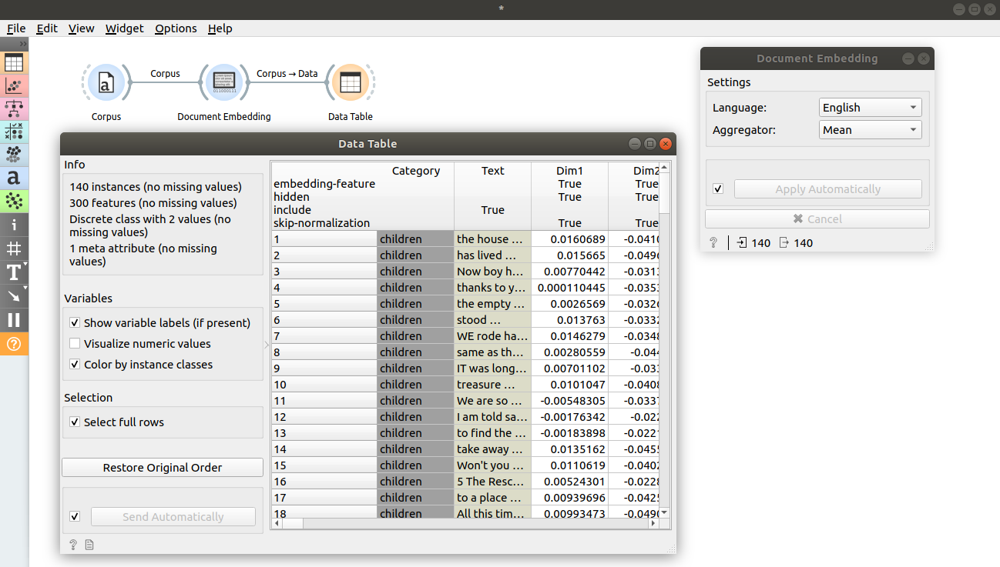
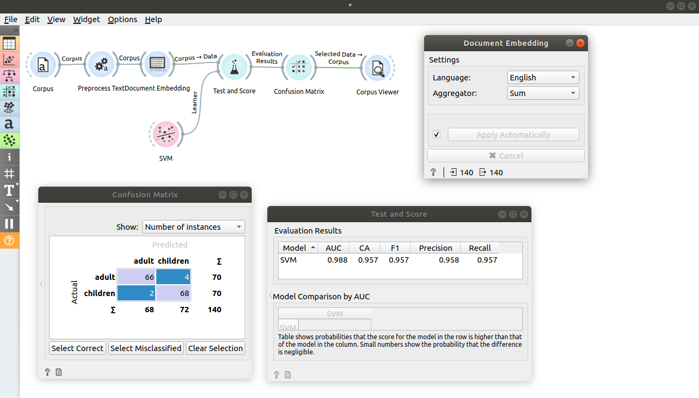

Document Embedding
==================

Embeds documents from input corpus into vector space by using pretrained
[fastText](https://fasttext.cc/docs/en/crawl-vectors.html) models described in 
E. Grave, P. Bojanowski, P. Gupta, A. Joulin, T. Mikolov,
Learning Word Vectors for 157 Languages.
Proceedings of the International Conference on Language Resources and Evaluation, 2018.

**Inputs**

- Corpus: A collection of documents.

**Outputs**

- Corpus: Corpus with new features appended.

**Document Embedding** parses ngrams of each document in corpus, obtains embedding 
for each ngram using pretrained model for chosen language and obtains one vector for each document by aggregating ngram embeddings using one of offered aggregators. Note that method will work on any ngrams but it will give best results if corpus is preprocessed such that ngrams are words (because model was trained to embed words).

1. Widget parameters:
    - Language: widget will use a model trained on documents in chosen language.
    - Aggregator: operation to perform on ngram embeddings to aggregate them into a single document vector.
2. Cancel current execution.
3. If *Apply automatically* is checked, changes in parameters are sent automatically. Alternatively press *Apply*.

Examples
--------

In first example, we will inspect how the widget works. Load *book-excerpts.tab* using [Corpus](corpus-widget.md) widget and connect it to **Document Embedding**. Check the output data by connecting **Document Embedding** to **Data Table**. We see additional 300 features that we widget has appended.

In the second example we will try to predict document category. We will keep working on *book-excerpts.tab* loaded with [Corpus](corpus-widget.md) widget and sent through [Preprocess Text](preprocesstext.md) with default parameters. Connect **Preprocess Text** to **Document Embedding** to obtain features for predictive modelling. Here we set aggregator to Sum.

Connect **Document Embedding** to **Test and Score** and also connect learner of choice to the left side of **Test and Score**. We chose SVM and changed kernel to Linear. **Test and Score** will now compute performance of each learner on the input. We can see that we achieved great results. 

Let's now inspect confusion matrix. Connect **Test and Score** to **Confusion Matrix**.
Clicking on *Select Misclassified* will output documents that were misclassified. We can further inspect them by connecting [Corpus Viewer](corpusviewer.md) to **Confusion Matrix**. 

