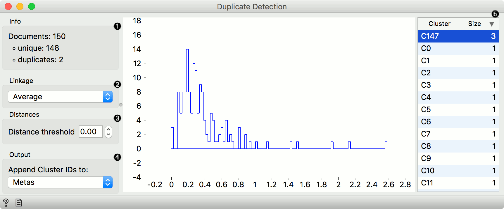
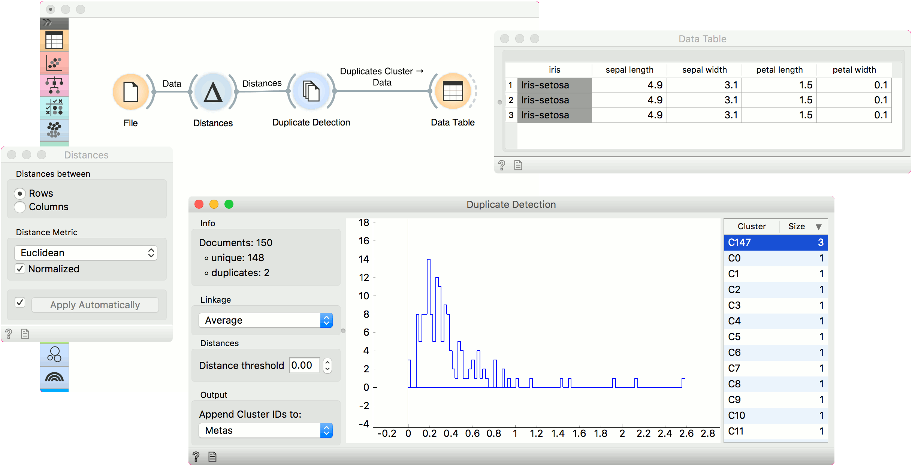

Duplicate Detection
===================

Detect & remove duplicates from a corpus.

**Inputs**

- Distances: A distance matrix.

**Outputs**

- Corpus Without Duplicated: Corpus with duplicates removed.
- Duplicates Cluster: Documents belonging to selected cluster.
- Corpus: Corpus with appended cluster labels.

**Duplicate Detection** uses clustering to find duplicates in the corpus. It is great with the [Twitter](twitter-widget.md) widget for removing retweets and other similar documents.

To set the level of similarity, drag the line vertical line left or right in the visualization. The further left the line, the more similar the documents have to be in order to be considered duplicates. You can also set the threshold manually in the control area.

1. Information on unique and duplicate documents.
2. Linkage used for clustering (Single, Average, Complete, Weighted and Ward).
3. Distance threshold sets the similarity cutoff. The lower the value, the more similar the data instances have to be to belong to the same cluster. You can also set the cutoff by dragging the vertical line in the plot.
4. Cluster labels can be appended as attributes, class or metas.
5. List of clusters at the selected threshold. They are sorted by size by default. Click on the cluster to observe its content on the output.

Example
-------

This simple example uses *iris* data to find identical data instances. Load *iris* with the **File** widget and pass it to **Distances**. In **Distances**, use Euclidean distance for computing the distance matrix. Pass distances to **Duplicate Detection**.

It looks like cluster C147 contain three duplicate entries. Let us select it in the widget and observe it in a **Data Table**. Remember to set the output to *Duplicates Cluster*. IThe three data instances are identical. To use the data set without duplicates, use the first output, *Corpus Without Duplicates*.

The same procedure can be used also for corpora. Remember to use the [Bag of Words](bagofwords-widget.md) between [Corpus](corpus-widget.md) and **Distances**.

