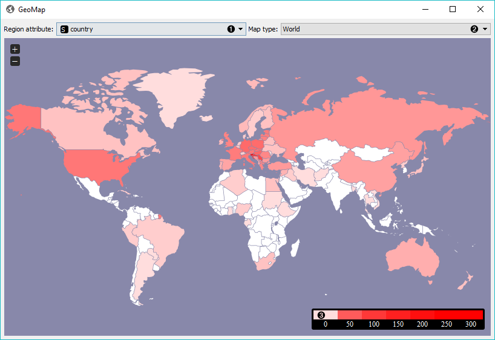

======
GeoMap
======

Displays geographic distribution of data. 

Signals
-------

**Inputs**:

-  **Data**

   Data set.

**Outputs**:

-  **Corpus**

   A :ref:`Corpus` instance.

Description
-----------

**GeoMap** widget shows geolocations from textual (string) data. It finds mentions of geographic names (countries and capitals) and displays distributions (frequency of mentiones) of these names on a map. It works with any Orange widget that outputs a data table and that contains at least one string attribute. The widget outputs selected data instances, that is all documents containing mentions of a selected country (or countries).

1. Select the meta attribute you want to search geolocations by. The widget will find all mentions of geolocations in a text and display distributions on a map.
2. Select the type of map you wish to display. The options are *World*, *Europe* and *USA*. You can zoom in and out of the map by pressing + and - buttons on a map or by mouse scroll.
3. The legend for the geographic distribution of data. Countries with the boldest color are most often mentioned in the selected region attribute (highest frequency).

To select documents mentioning a specific country, click on a country and the widget will output matching documents. To select more than one country hold Ctrl/Cmd upon selection.

Example
-------

**GeoMap** widget can be used for simply visualizing distributions of geolocations or for a more complex interactive data analysis. Here, we've queried :doc:`NY Times <nytimes>` for articles on Slovenia for the time period of the last year (2015-2016). First we checked the results with :doc:`Corpus Viewer <corpusviewer>`.

.. figure:: images/GeoMap-Example.png

Then we sent the data to **GeoMap** to see distributiosn of geolocations by *country* attribute. The attribute already contains country tags for each article, which is why **NY Times** is great in combinations with **GeoMap**. We selected Germany, which sends all the documents tagged with Germany to the output. Remember, we queried **NY Times** for articles on Slovenia.

We can again inspect the output with **Corpus Viewer**. But there's a more interesting way of visualizing the data. We've sent selected documents to :doc:`Preprocess Text <preprocesstext>`, where we've tokenized text to words and removed stopwords.

Finally, we can inspect the top words appearing in last year's documents on Slovenia and mentioning also Germany with :doc:`Word Cloud <wordcloud>`.
