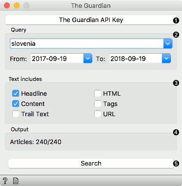
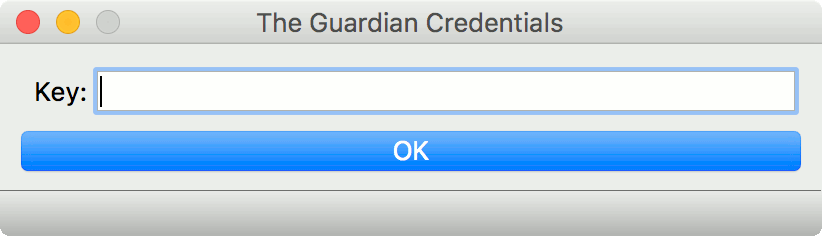
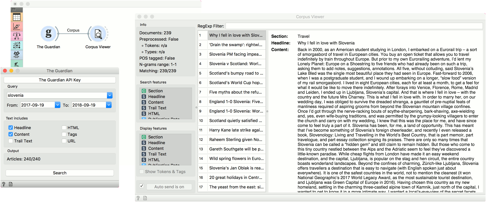

The Guardian
============

Fetching data from [The Guardian Open Platform](http://open-platform.theguardian.com).

**Inputs**

- None

**Outputs**

- Corpus: A collection of documents from the Guardian newspaper.

**Guardian** retrieves articles from the Guardian newspaper via their API. For the widget to work, you need to provide the API key, which you can get at [their access platform](https://open-platform.theguardian.com/access/).

1. Insert the API key for the widget to work.

   

2. Provide the query and set the time frame from which to retrieve the articles.
3. Define which features to retrieve from the Guardian platform.
4. Information on the output.
5. Press *Search* to start retrieving the articles or *Stop* to stop the retrieval.

Example
-------

**Guardian** can be used just like any other data retrieval widget in Orange, namely [NY Times](nytimes.md), [Wikipedia](wikipedia-widget.md), [Twitter](twitter-widget.md) or [PubMed](pubmed.md).

We will retrieve 240 articles mentioning *slovenia* between september 2017 and september 2018. The text will include article headline and content. Upon pressing *Search*, the articles will be retrieved.

We can observe the results in the [Corpus Viewer](corpusviewer.md) widget.

