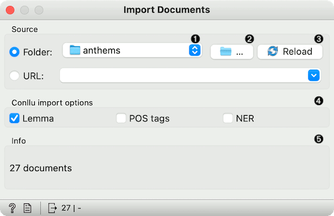
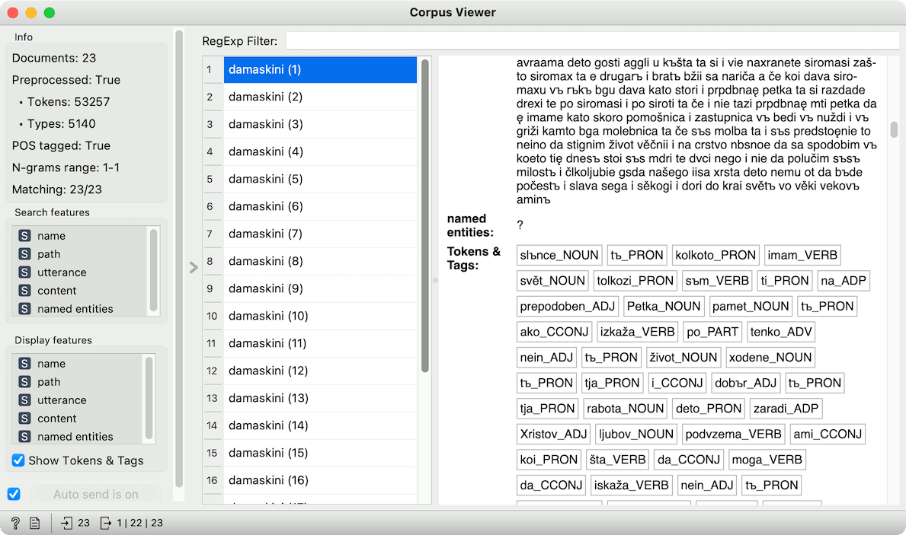
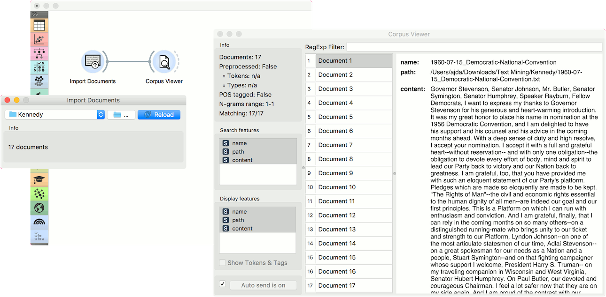
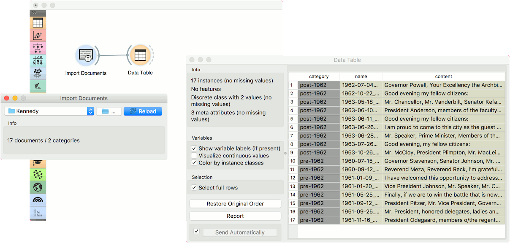

Import Documents
================

Import text documents from folders.

**Inputs**

- None

**Outputs**

- Corpus: A collection of documents from the local machine.
- Skipped Documents: A list of documents that couldn't be imported.

**Import Documents** widget retrieves text files from folders and creates a corpus. The widget reads .txt, .docx, .odt, .pdf, .xml, and .conllu files. If a folder contains subfolders, they will be used as class labels.

1. Folder being loaded.
2. Load folder from a local machine.
3. Reload the data.
4. Options for importing .conllu files.
5. Number of documents retrieved.

If the widget cannot read the file for some reason, the file will be skipped. Files that were successfully retrieved will still be on the output.

Conllu files
------------

Since Text version 1.5.0, Orange supports reading [.conllu files](https://universaldependencies.org/format.html). Each file will be considered as a separate document in the corpus. If utterance IDs exist, utterances will become documents (each row in the corpus will be a single utterance).

Lemmas and POS tags from *Conllu import options* will be added as tokens and the corpus will be considered preprocessed. Named entities will be added as a comma-separated string (if they exist in the file).

Example
-------

To retrieve the data, select the folder icon on the right side of the widget. Select the folder you wish to turn into corpus. Once the loading is finished, you will see how many documents the widget retrieved. To inspect them, connect the widget to [Corpus Viewer](corpusviewer.md). We've used a set of Kennedy's speeches in a plain text format.

Now let us try it with subfolders. We have placed Kennedy's speeches in two folders - pre-1962 and post-1962. If I load the parent folder, these two subfolders will be used as class labels. Check the output of the widget in a **Data Table**.

