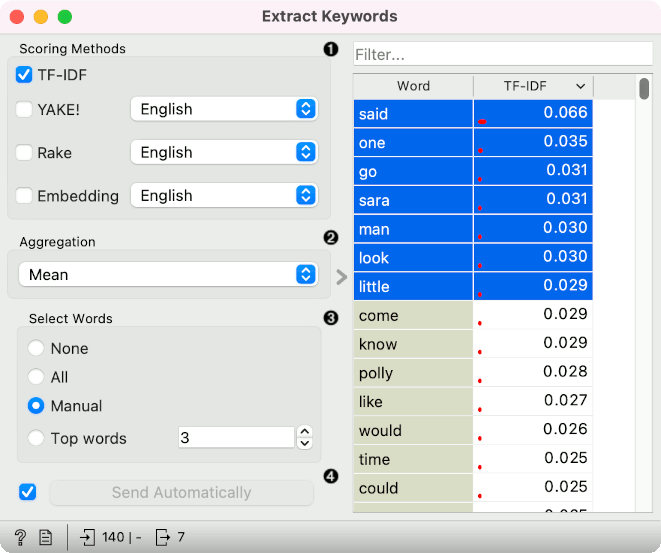

Extract Keywords
================

Infers characteristic words from the input corpus.

**Inputs**

- Corpus: A collection of documents.
- Words: A table of words.

**Outputs**

- Words: A table of words.

**Extract Keywords** infers characteristic words from corpus.

1. Scoring methods for extracting words:
   - TF-IDF, a method that scores by term frequency weighted by inverse document frequency. A word that is characteristic for a small number of documents, will have a high TF-IDF score, while words that appear in the entire corpus will have a low score.
   - [YAKE!](http://yake.inesctec.pt/), an unsupervised state-of-the-art method that works with texts of different sizes.
   - [Rake](https://github.com/zelandiya/RAKE-tutorial), an unsupervised domain-independent method based around stopword delimiters.
   - Embedding, a proprietary method that gives higher scores to words that have the closest cosine distance to most documents. The distance is computed on SBERT word embeddings.

Example
-------

In the below example, we are using the *book-excerpts* corpus, which is available in the [Corpus](corpus-widget.md) widget. 

We pass the corpus to [Preprocess Text](preprocesstext.md), where we lowercase the text, split it into words with tokenization, use Lemmagen lemmatizer to cover tokens to their base form and finally remove stopwords.

Next, we find characteristic words with [Extract Keywords](keywords.md) widget using the TF-IDF method. The widget returns a list of words and we can select the top-ranked words to send to the output. 

We can use these words in [Word List](wordlist.md), where we can edit them, add to them or remove them. Alternatively, we can send the candidate words directly to Semantic Viewer or Score Documents.

References
----------

Campos, R., Mangaravite, V., Pasquali, A., Jatowt, A., Jorge, A., Nunes, C. and Jatowt, A. (2020). YAKE! Keyword Extraction from Single Documents using Multiple Local Features. In *Information Sciences Journal*. Elsevier, Vol 509, pp 257-289

Rose, S., Engel, D., Cramer, N. and Cowley, W. (2010). Automatic Keyword Extraction from Individual Documents. In *Text Mining* (eds M.W. Berry and J. Kogan). https://doi.org/10.1002/9780470689646.ch1
