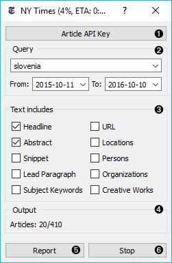
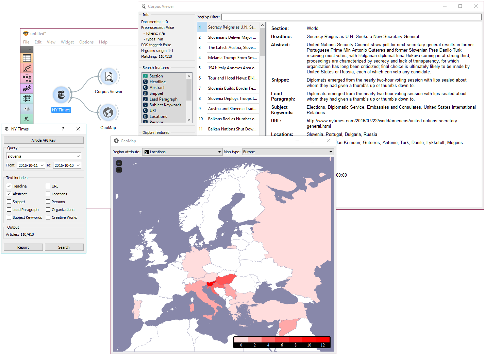

========
NY Times
========

Loads data from the New York Times' `Article Search API <https://developer.nytimes.com/>`_.

Signals
-------

**Inputs**:

-  (None)

**Outputs**:

-  **Corpus**

   A :ref:`Corpus` instance.

Description
-----------

**NYTimes** widget loads data from New York Times' Article Search API. You can query NYTimes articles from September
18, 1851 to today, but the API limit is set to allow retrieving only a 1000 documents per query. Define which features to use for text mining, *Headline* and *Abstract* being selected by default.

To use the widget, you must enter `your own API key <https://developer.nytimes.com/signup>`_.

1. To begin your query, insert NY Times' Article Search API key. The key is securely saved in your system keyring service (like Credential Vault, Keychain, KWallet, etc.) and won't be deleted when clearing widget settings.

   .. figure:: images/NYT-API.png

2. Set query parameters:
	- *Query*
	- Query time frame. The widget allows querying articles from September 18, 1851 onwards. Default is set to 1 year back from the current date.

3. Define which features to include as text features.

4. Information on the output.

5. Produce report.

6. Run or stop the query.

Example
-------

**NYTimes** is a data retrieving widget, similar to :doc:`Twitter <twitter>` and :doc:`Wikipedia <wikipedia>`. As it can retrieve geolocations, that is geographical locations the article mentions, it is great in combination with :doc:`GeoMap <geomap>` widget.

First, let's query **NYTimes** for all articles on Slovenia. We can retrieve the articles found and view the results in :doc:`Corpus Viewer <corpusviewer>`. The widget displays all the retrieved features, but includes on selected features as text mining features.

Now, let's inspect the distribution of geolocations from the articles mentioning Slovenia. We can do this with :doc:`GeoMap <geomap>`. Unsuprisignly, Croatia and Hungary appear the most often in articles on Slovenia (discounting Slovenia itself), with the rest of Europe being mentioned very often as well.
