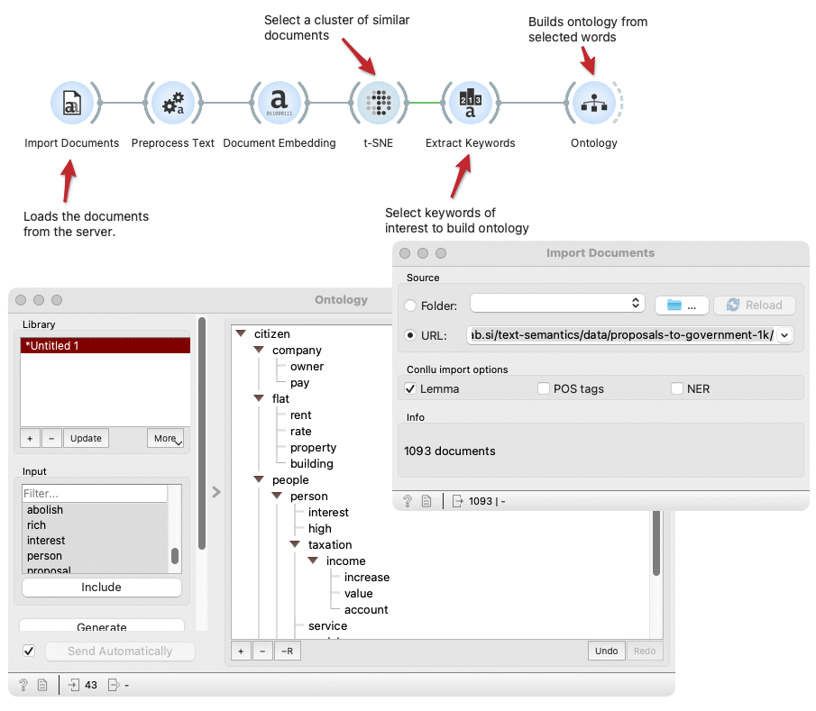

Ontology
========

Generate, edit, load and save ontologies.

**Inputs**

- Words: A table of words.

**Outputs**

- Words: A table of words.

The ontology widget enables various operations with ontologies:
- Generate ontology from words on the input
- Load existing ontology from a file or URL. The widget supports OWL, JSON, and Pickle formats.
- Manually edit the ontology
- Include word from the input in the existing ontology to the position where it fits best according to the fitness function
- Save ontology to file

Ontologies are generated using the genetic algorithm. The fitness function used in 
the algorithm determines the quality of a generated ontology by considering pairwise 
cosine similarities between each word in the ontology and its parent and siblings. 
More concretely, the similarity is computed between SBERT embeddings of said words. 
The fitness function also accounts for the average number of children each word has 
(to avoid too shallow or too deep ontologies) and the syntactic overlap between words 
and their children along with their respective lengths (this term is intended to push 
more general words above the less general ones).

1. Switch between saved ontologies, add or remove ontology to the library, load or save ontology from/to file.
2. Browse words from the widget's input, include selected terms automatically in the existing ontology with the `Include` button or grab a word from the list and drop it in the ontology on the right.
3. (Re)Generate new ontology from all words in the tree on the right.
4. Set whether the output list includes words in the subtree of selected words even if they are not selected.
5. Fitness score of current ontology.
6. Ontology editor and viewer. Drag and drop words to the desired position in the tree, add or remove words with the buttons at the bottom and undo or redo changes. 
7. Get help, add ontology to the report, or input and output. 

Example
-------

This example loads the proposals to the government from the URL 
`http://file.biolab.si/text-semantics/data/proposals-to-government-1k/`, 
preprocess texts, embedded texts to the vector space with the fastText embedding 
and shows t-SNE document map. We select a group of documents connected with the 
property-owning in the document map. Extract Keywords widget extracts keywords 
of selected subset and sends them to 
the Ontology widget. In the Ontology widget, we drag words from the Input list 
to the pane on the right and click the Generate button. After the widget generates 
the ontology, we can manually perform some minor changes to make ontology even more 
meaningful.

