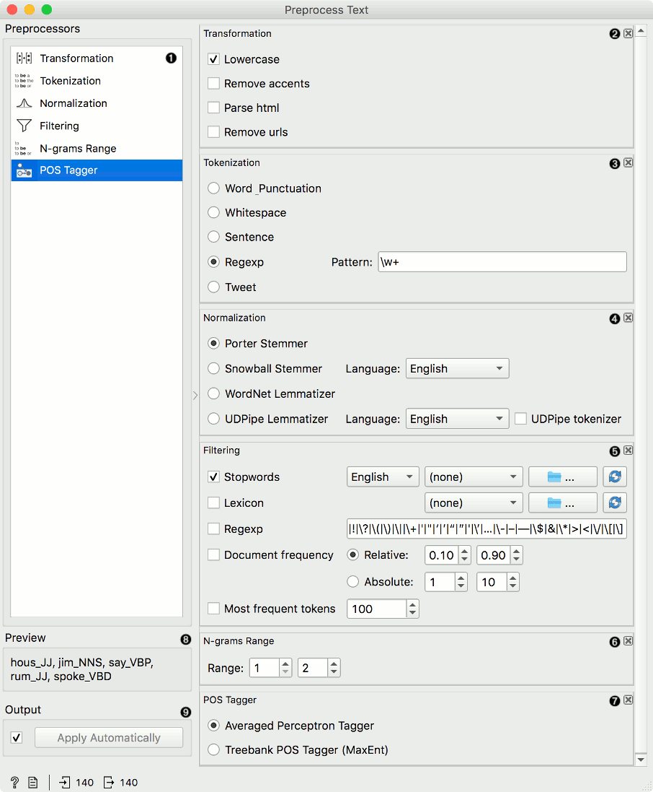
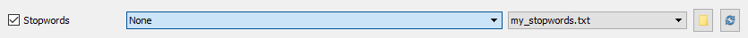
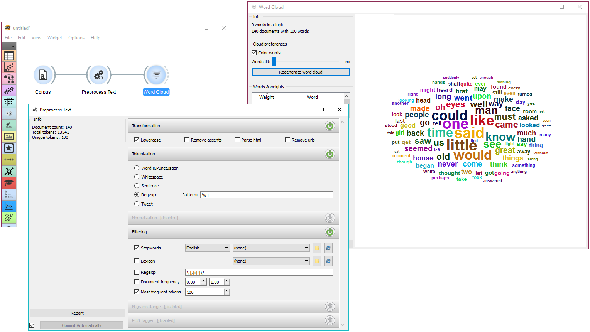
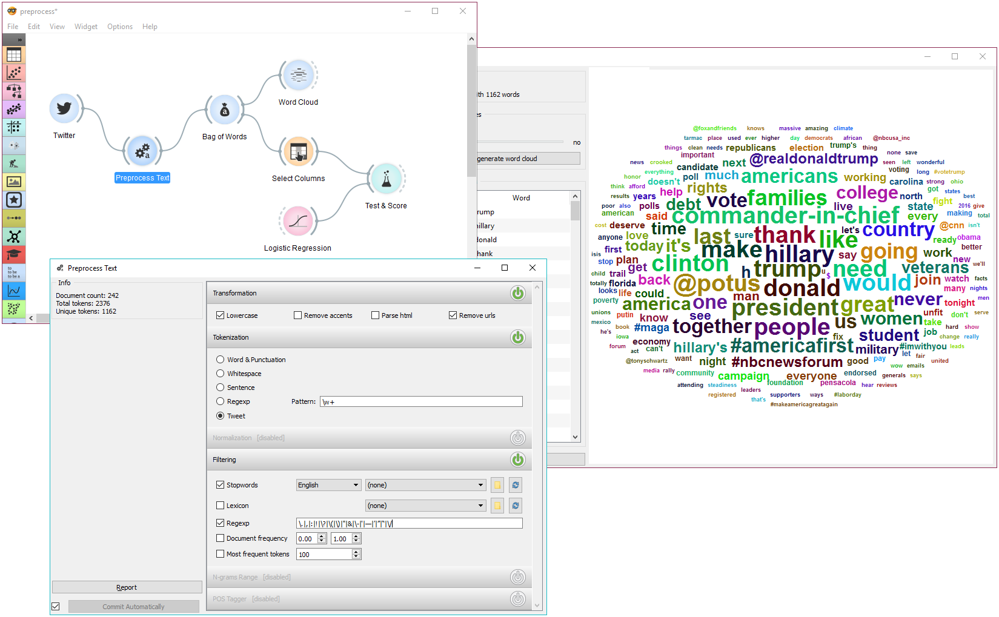

Preprocess Text
===============

Preprocesses corpus with selected methods.

**Inputs**

- Corpus: A collection of documents.

**Outputs**

- Corpus: Preprocessed corpus.

**Preprocess Text** splits your text into smaller units (tokens), filters them, runs [normalization](https://en.wikipedia.org/wiki/Stemming) (stemming, lemmatization), creates [n-grams](https://en.wikipedia.org/wiki/N-gram) and tags tokens with [part-of-speech](https://en.wikipedia.org/wiki/Part_of_speech) labels. Steps in the analysis are applied sequentially and can be reordered. Click and drag the preprocessor to change the order.

1. Available preprocessors.
2. **Transformation** transforms input data. It applies lowercase transformation by default.
    - *Lowercase* will turn all text to lowercase.
    - *Remove accents* will remove all diacritics/accents in text.
      naïve → naive
    - *Parse html* will detect html tags and parse out text only.
      \<a href...>Some text\</a> → Some text
    - *Remove urls* will remove urls from text.
      This is a http://orange.biolab.si/ url. → This is a url.
3. [Tokenization ](https://en.wikipedia.org/wiki/Tokenization_(lexical_analysis)) is the method of breaking the text into smaller components (words, sentences, bigrams).
    - *Word & Punctuation* will split the text by words and keep punctuation symbols.
      This example. → (This), (example), (.)
    - *Whitespace* will split the text by whitespace only.
      This example. → (This), (example.)
    - *Sentence* will split the text by full stop, retaining only full sentences.
      This example. Another example. → (This example.), (Another example.)
    - [Regexp](https://en.wikipedia.org/wiki/Regular_expression) will split the text by provided regex. It splits by words only by default (omits punctuation).
    - *Tweet* will split the text by pre-trained Twitter model, which keeps hashtags, emoticons and other special symbols.
      This example. :-) #simple → (This), (example), (.), (:-)), (#simple)
4. **Normalization** applies stemming and lemmatization to words. (I've always loved cats. → I have alway love cat.) For languages other than English use Snowball Stemmer (offers languages available in its NLTK implementation) or UDPipe.
    - [Porter Stemmer](https://tartarus.org/martin/PorterStemmer/) applies the original Porter stemmer.
    - [Snowball Stemmer](http://snowballstem.org/) applies an improved version of Porter stemmer (Porter2). Set the language for normalization, default is English.
    - [WordNet Lemmatizer](http://wordnet.princeton.edu/) applies a networks of cognitive synonyms to tokens based on a large lexical database of English.
    - [UDPipe](http://ufal.mff.cuni.cz/udpipe/1) applies a [pre-trained model](https://lindat.mff.cuni.cz/repository/xmlui/handle/11234/1-2998?show=full) for normalizing data.
5. **Filtering** removes or keeps a selection of words.
    - *Stopwords* removes stopwords from text (e.g. removes 'and', 'or', 'in'...). Select the language to filter by, English is set as default. You can also load your own list of stopwords provided in a simple \*.txt file with one stopword per line.
      
      Click 'browse' icon to select the file containing stopwords. If the file was properly loaded, its name will be displayed next to pre-loaded stopwords. Change 'English' to 'None' if you wish to filter out only the provided stopwords. Click 'reload' icon to reload the list of stopwords.
    - *Lexicon* keeps only words provided in the file. Load a \*.txt file with one word per line to use as lexicon. Click 'reload' icon to reload the lexicon.
    - *Regexp* removes words that match the regular expression. Default is set to remove punctuation.
    - *Document frequency* keeps tokens that appear in not less than and not more than the specified number / percentage of documents. Absolute keeps only tokens that appear in the specified number of documents. E.g. DF = (3, 5) keeps only tokens that appear in 3 or more and 5 or less documents. Relative keeps only tokens that appear in the specified percentage of documents. E.g. DF = (0.3, 0.5) keeps only tokens that appear in 30% to 50% of documents.
    - *Most frequent tokens* keeps only the specified number of most frequent tokens. Default is a 100 most frequent tokens.
6. **N-grams Range** creates n-grams from tokens. Numbers specify the range of n-grams. Default returns one-grams and two-grams.
7. **POS Tagger** runs part-of-speech tagging on tokens.
    - [Averaged Perceptron Tagger](https://spacy.io/blog/part-of-speech-pos-tagger-in-python) runs POS tagging with Matthew Honnibal's averaged perceptron tagger.
    - [Treebank POS Tagger (MaxEnt)](http://web.mit.edu/6.863/www/fall2012/projects/writeups/max-entropy-nltk.pdf) runs POS tagging with a trained Penn Treebank model.
8. Preview of preprocessed data.
9. If *Commit Automatically* is on, changes are communicated automatically. Alternatively press *Commit*.

**Note**! Preprocess Text applies preprocessing steps in the order they are listed. A good order is to first transform the text, then apply tokenization, POS tags, normalization, filtering and finally constructs n-grams based on given tokens. This is especially important for WordNet Lemmatizer since it requires POS tags for proper normalization.

Useful Regular Expressions
--------------------------

Here are some useful regular expressions for quick filtering:

`\bword\b`: matches exact word
`\w+`: matches only words, no punctuation
`\b(B|b)\w+\b`: matches words beginning with the letter b
`\w{4,}`: matches words that are longer than 4 characters  
`\b\w+(Y|y)\b`: matches words ending with the letter y

Examples
--------

In the first example we will observe the effects of preprocessing on our text. We are working with *book-excerpts.tab* that we've loaded with [Corpus](corpus-widget.md) widget. We have connected **Preprocess Text** to **Corpus** and retained default preprocessing methods (lowercase, per-word tokenization and stopword removal). The only additional parameter we've added as outputting only the first 100 most frequent tokens. Then we connected **Preprocess Text** with [Word Cloud](wordcloud.md) to observe words that are the most frequent in our text. Play around with different parameters, to see how they transform the output.

The second example is slightly more complex. We first acquired our data with [Twitter](twitter-widget.md) widget. We quired the internet for tweets from users @HillaryClinton and @realDonaldTrump and got their tweets from the past two weeks, 242 in total.

In **Preprocess Text** there's *Tweet* tokenization available, which retains hashtags, emojis, mentions and so on. However, this tokenizer doesn't get rid of punctuation, thus we expanded the Regexp filtering with symbols that we wanted to get rid of. We ended up with word-only tokens, which we displayed in [Word Cloud](wordcloud.md). Then we created a schema for predicting author based on tweet content, which is explained in more details in the documentation for [Twitter](twitter-widget.md) widget.
