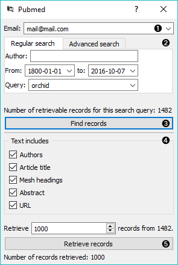
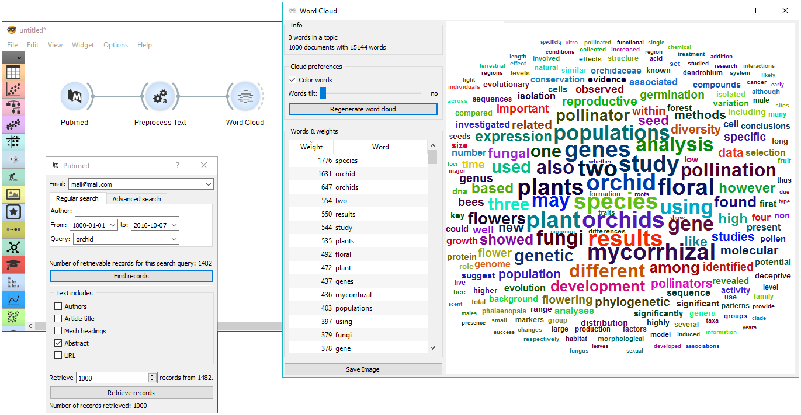

======
Pubmed
======

Fetch data from `PubMed <http://www.ncbi.nlm.nih.gov/pubmed>`_ journals.

Signals
-------

**Inputs**:

-  (None)

**Outputs**:

-  **Corpus**

   A :ref:`Corpus` instance.

Description
-----------

`PubMed <http://www.ncbi.nlm.nih.gov/pubmed>`_ comprises more than 26 million citations for biomedical literature from MEDLINE, life science journals, and online books. The widget allows you to query and retrieve these entries. You can use regular search or construct advanced queries.

1. Enter a valid e-mail to retrieve queries.

2. *Regular search*:
	- *Author*: queries entries from a specific author. Leave empty to query by all authors.
	- *From*: define the time frame of publication.
	- *Query*: enter the query.

   *Advanced search*: enables you to construct complex queries. See `PubMed's website <https://www.ncbi.nlm.nih.gov/pubmed/advanced>`_ to learn how to construct such queries. You can also copy-paste constructed queries from the website.

3. *Find records* finds available data from PubMed matching the query. Number of records found will be displayed above the button.

4. Define the output. All checked features will be on the output of the widget.

5. Set the number of record you wish to retrieve. Press *Retrieve records* to get results of your query on the output. Below the button is an information on the number of records on the output.

Example
-------

**PubMed** can be used just like any other data widget. In this example we've queried the database for records on orchids. We retrieved 1000 records and kept only 'abstract' in our meta features to limit the construction of tokens only to this feature.

We used :doc:`Preprocess Text <preprocesstext>` to remove stopword and words shorter than 3 characters (regexp ``\b\w{1,2}\b``). This will perhaps get rid of some important words denoting chemicals, so we need to be careful with what we filter out. For the sake of quick inspection we only retained longer words, which are displayed by frequency in :doc:`Word Cloud <wordcloud>`.
