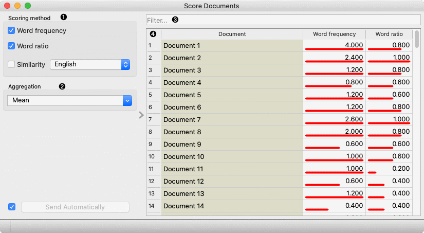

Score Documents
===============

Scores documents based on word appearance.

**Inputs**

- Corpus: A collection of documents
- Words: A table with at least one column with words

**Outputs**

- Corpus: A collection of documents with scores

**Score Document** assigns scores to each document based on words at the input. The score with the selected scoring method is calculated for each word and aggregated together with the selected aggregation function on the document level.

1. Select one or more scoring methods for words:
   - **Word frequency**: The count of the frequency of a word in the text.  
   - **Word ratio**: Indicate the appearance of the word in the document.
   - **Similarity**: The cosine similarity between document embedding and word embedding.
2. Select aggregation function to aggregate word scores in document scores.
3. Filter documents based on the document title in the first column
4. The table with the document titles in the first column and scores for in other columns.
