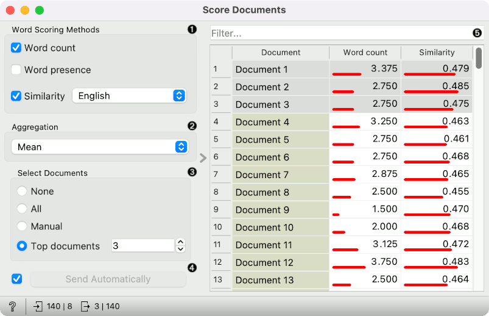
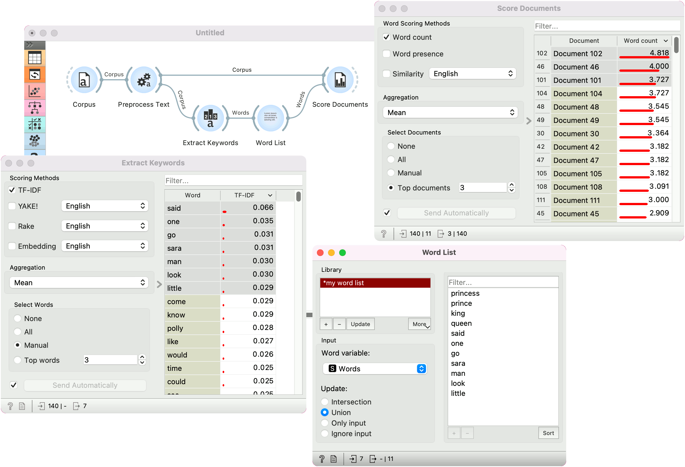

Score Documents
===============

Scores documents based on word appearance.

**Inputs**

- Corpus: A collection of documents
- Words: A table with at least one column with words

**Outputs**

- Corpus: A collection of documents with scores

**Score Document** assigns scores to each document based on words at the input. The score with the selected scoring method is calculated for each word and aggregated together with the selected aggregation function on the document level.

1. Select one or more scoring methods for words:
   - **Word frequency**: The count of the frequency of a word in the text.  
   - **Word ratio**: Indicate the appearance of the word in the document.
   - **Similarity**: The cosine similarity between document embedding and word embedding.
2. Select aggregation function to aggregate word scores to document scores (mean, median, min or max).
3. Select documents:
   - None: no documents are on the output
   - All: the entire corpus is on the output
   - Manual: manually select the documents from the table
   - Top documents: n top-scored documents are sent to the output
4. If *Send Automatically*, changes are communicated automatically. Alternatively press *Send*.
5. Filter documents based on the document title in the first column. Below is the table with the document titles in the first column and scores in other columns.

**Note**: Score Documents will apply preprocessing from the input Corpus to words before scoring.

Example
-------

Score Documents is used to find documents that are semantically similar to the input word list. In the example below, we are using the *book-excerpts* corpus from the [Corpus](corpus-widget.md) widget.

We pass the corpus to [Preprocess Text](preprocesstext.md), where we lowercase the text, split it into words with tokenization, use Lemmagen lemmatizer to cover tokens to their base form and finally remove stopwords.

Next, we find characteristic words with [Extract Keywords](keywords.md) widget and send these words to [Word List](wordlist.md). There, we add some of our own words, such as princess, prince, king and queen.

Finally, we pass the preprocess corpus from Preprocess Text to Score Documents and the word list from Word List widget. Score Documents scores each document based on how frequently the input words appear in it.

