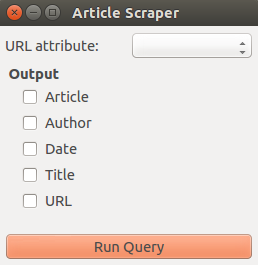
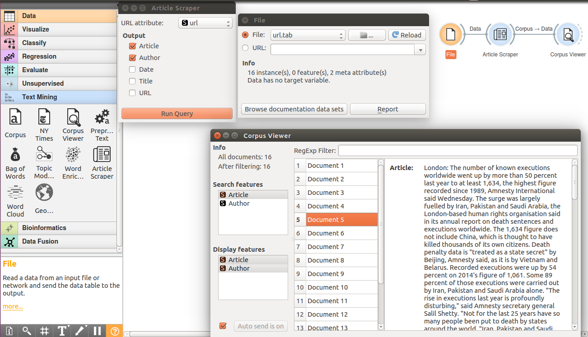

================
Article Scraper
================

Gets the Article, Date, Title, Author from the URL

Signals
-------

**Inputs**:

-  **Data**

A data set.

**Outputs**:

-  **Corpus**

Article Data, Corpus object with the selected Outputs.

Description
-----------

The **Article Scraper** widget offers five outputs methods to improve
data quality. In this widget you can give a file with URLs as input, 
If there are multiple columns in the file, selected the column with urls using the dropdown list
 in the URL attribute. It would scrape the respective webpages and get the Article, Date, Title, Author from the URL.
You can selected what you want in the output using the checkboxes. Click Run Query to generate the Corpus.

Example
-------

In the example below we have used *url* data set and get the article data 
from the URL's. We select the URL attribute from the dropdown list (topic, url).
Check the box for the attribute that you want to include in output (Article, Author, Date, Title, URL).
Click Run Query. You get a Corpus Object as Output 

