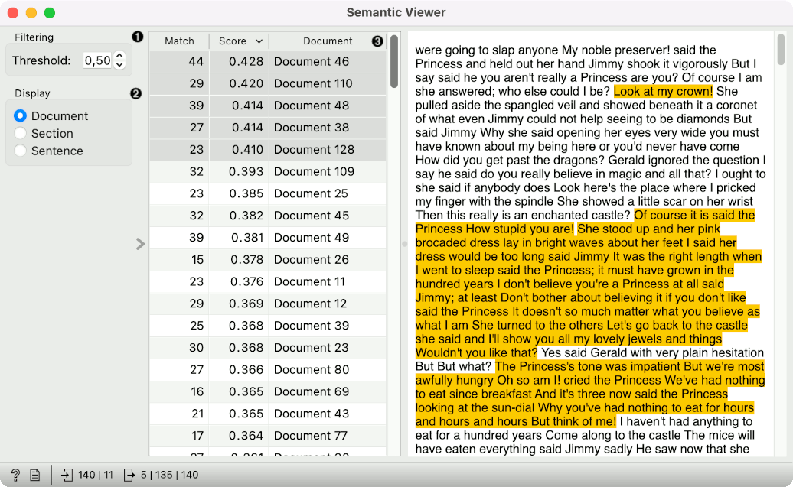

Semantic Viewer
===============

Displays corpus semantics.

**Inputs**

- Corpus: A collection of documents.
- Words: A table of words.

**Outputs**

- Matching Docs: Selected documents.
- Other Docs: Other documents.
- Corpus: A collection of documents.

**Semantic Viewer** is meant for viewing corpus semantics. The widget takes input words and find documents or document passages containing these words.

1. Filtering. Set the threshold above which text passages will be colored. The threshold is the sentence-level score, which is computed as the maximum cosine similarity between the SBERT embeddings and each sentence. Only sentences with the score above the threshold will be colored.
2. Display either the entire document, the relevant section of the text or only the relevant sentence(s).
3. A list of matches, scores and documents. A match is the number of matching words from the input in each document. Score is computed at a sentence level by taking the maximum cosine similarity between the SBERT embeddings of the sentence and the input keywords. The score is than aggregated to the document score, which is displayed in the list.

Example
-------

In the below example, we are using the *book-excerpts* corpus, which is available in the [Corpus](corpus-widget.md) widget. 

We pass the corpus to [Preprocess Text](preprocesstext.md), where we lowercase the text, split it into words with tokenization, use Lemmagen lemmatizer to cover tokens to their base form and finally remove stopwords.

Next, we find characteristic words with [Extract Keywords](keywords.md) widget and send these words to [Word List](wordlist.md). There, we add some of our own words, such as princess, prince, king and queen.

Finally, we pass the entire list of words to Semantic Viewer along with the corpus from Prepreprocess Text. The widget uses input word list to find matching passages in each document. We can now see parts of the text talking about princesses, queens, and so on.

