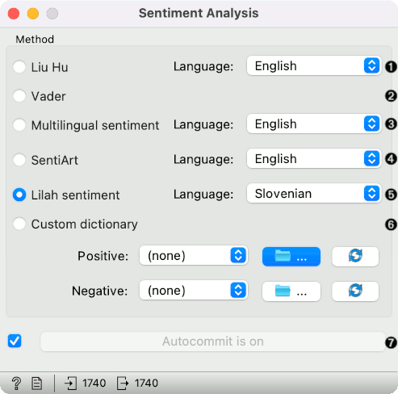
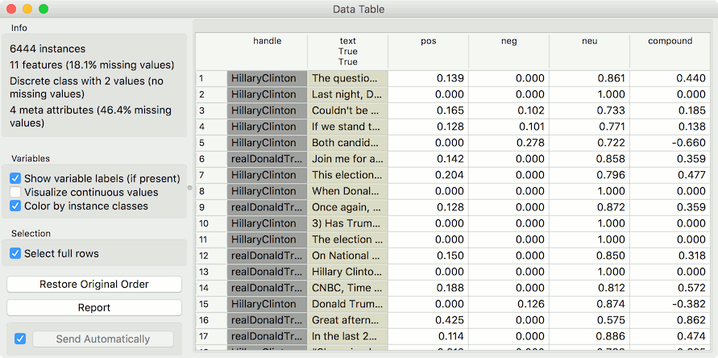
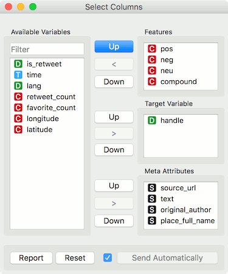
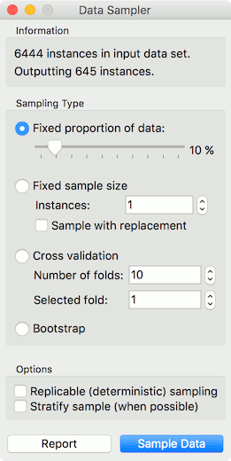
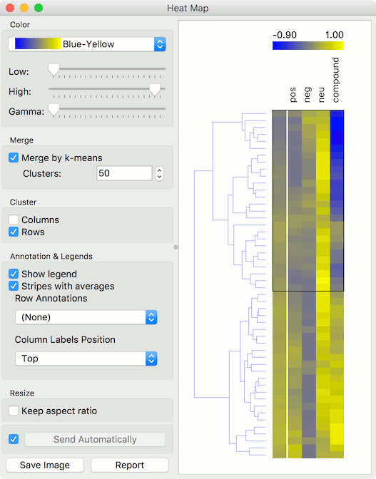
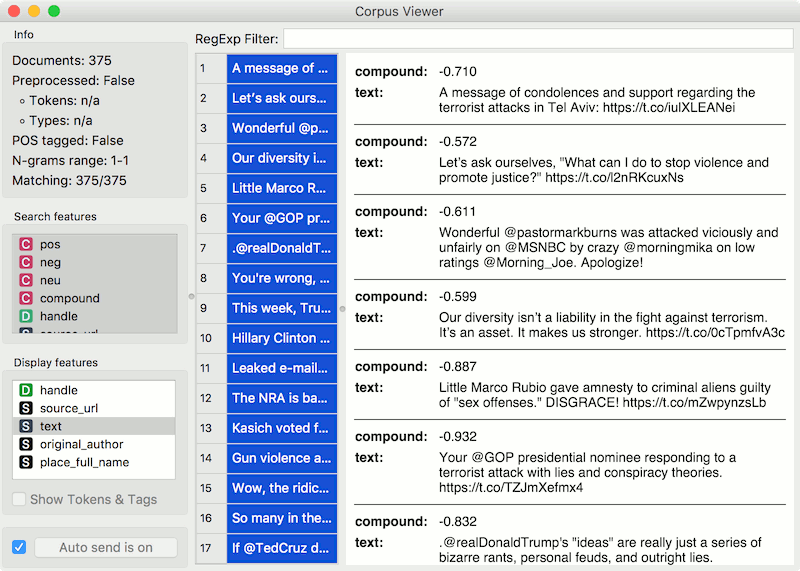
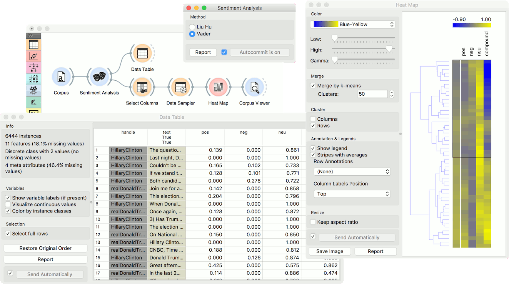

Sentiment Analysis
==================

Predict sentiment from text.

**Inputs**

- Corpus: A collection of documents.

**Outputs**

- Corpus: A corpus with information on the sentiment of each document.

**Sentiment Analysis** predicts sentiment for each document in a corpus. It uses Liu Hu and Vader sentiment modules from [NLTK](http://www.nltk.org/api/nltk.sentiment.html). Both of them are lexicon-based. For Liu Hu, you can choose English or Slovenian version.

1. *Method*:
   - *Liu Hu*: lexicon-based sentiment analysis (supports English and Slovenian)
   - *Vader*: lexicon- and rule-based sentiment analysis
2. Produce a report.
3. If *Auto commit is on*, sentiment-tagged corpus is communicated automatically. Alternatively press *Commit*.

Example
-------

*Sentiment Analysis* can be used for constructing additional features with sentiment prediction from corpus. First, we load *Election-2016-tweets.tab* in [Corpus](corpus-widget.md). Then we connect **Corpus** to **Sentiment Analysis**. The widget will append 4 new features for Vader method: positive score, negative score, neutral score and compound (combined score).

We can observe new features in a **Data Table**, where we sorted the *compound* by score. Compound represents the total sentiment of a tweet, where -1 is the most negative and 1 the most positive.

Now let us visualize the data. We have some features we are currently not interested in, so we will remove them with **Select Columns**.

Then we will make our corpus a little smaller, so it will be easier to visualize. Pass the data to **Data Sampler** and retain a random 10% of the tweets.

Now pass the filtered corpus to **Heat Map**. Use *Merge by k-means* to merge tweets with the same polarity into one line. Then use *Cluster* by *rows* to create a clustered visualization where similar tweets are grouped together. Click on a cluster to select a group of tweets - we selected the negative cluster.

To observe the selected subset, pass the tweets to [Corpus Viewer](corpusviewer.md).

References
----------

Hutto, C.J. and E. E. Gilbert (2014). VADER: A Parsimonious Rule-based Model for Sentiment Analysis of Social Media Text. Eighth International Conference on Weblogs and Social Media (ICWSM-14). Ann Arbor, MI, June 2014.

Hu, Minqing and Bing Liu (2004). Mining opinion features in customer reviews. In Proceedings of AAAI Conference on Artificial Intelligence, vol. 4, pp. 755–760. [Available online.](http://www.aaai.org/Papers/AAAI/2004/AAAI04-119.pdf) 

Kadunc, Klemen and Marko Robnik-Šikonja (2016). Analiza mnenj s pomočjo strojnega učenja in slovenskega leksikona sentimenta. Conference on Language Technologies & Digital Humanities, Ljubljana (in Slovene). [Available online.](http://www.sdjt.si/wp/wp-content/uploads/2016/09/JTDH-2016_Kadunc-et-al_Analiza-mnenj-s-pomocjo-strojnega-ucenja.pdf)
