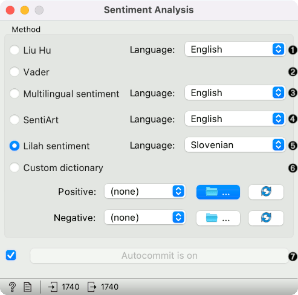

==================
Sentiment Analysis
==================

.. figure:: icons/sentiment-analysis.png

Predict sentiment from text.

Signals
-------

**Inputs**:

-  **Corpus**

   A :ref:`Corpus` instance.

**Outputs**:

-  **Corpus**

   A :ref:`Corpus` instance.   

Description
-----------

**Sentiment Analysis** predicts sentiment for each document in a corpus. It uses Liu Hu and Vader sentiment modules from `NLTK <http://www.nltk.org/api/nltk.sentiment.html>`_. Both of them are lexicon-based.

1. *Method*:
	- *Liu Hu*: lexicon-based sentiment analysis
	- *Vader*: lexicon- and rule-based sentiment analysis
2. Produce a report.
3. If *Auto commit is on*, sentiment-tagged corpus is communicated automatically. Alternatively press *Commit*.

Example
-------

*Sentiment Analysis* can be used for constructing additional features with sentiment prediction from corpus. First, we load *Election-2016-tweets.tab* in :doc:`Corpus <corpus>`. Then we connect **Corpus** to **Sentiment Analysis**. The widget will append 4 new features for Vader method: positive score, negative score, neutral score and compound (combined score).

We can observe new features in a **Data Table**, where we sorted the *compound* by score. Compound represents the total sentiment of a tweet, where -1 is the most negative and 1 the most positive.

.. figure:: images/Sentiment-DataTable.png

Now let us visualize the data. We have some features we are currently not interested in, so we will remove them with **Select Columns**.

.. figure:: images/Sentiment-SelectColumns.png

Then we will make our corpus a little smaller, so it will be easier to visualize. Pass the data to **Data Sampler** and retain a random 10% of the tweets.

.. figure:: images/Sentiment-DataSampler.png

Now pass the filtered corpus to **Heat Map**. Use *Merge by k-means* to merge tweets with the same polarity into one line. Then use *Cluster* by *rows* to create a clustered visualization where similar tweets are grouped together. Click on a cluster to select a group of tweets - we selected the negative cluster.

.. figure:: images/Sentiment-HeatMap.png

To observe the selected subset, pass the tweets to :doc:`Corpus Viewer <corpusviewer>`.

.. figure:: images/Sentiment-CorpusViewer.png

.. figure:: images/Sentiment-workflow.png

References
----------

Hutto, C.J. & Gilbert, E.E. (2014). VADER: A Parsimonious Rule-based Model for Sentiment Analysis of Social Media Text. Eighth International Conference on Weblogs and Social Media (ICWSM-14). Ann Arbor, MI, June 2014.
