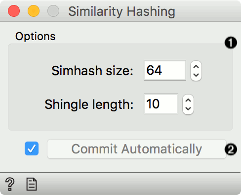
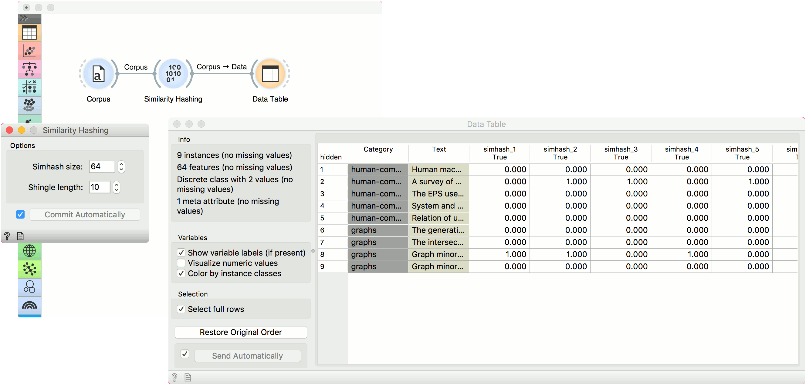

Similarity Hashing
==================

Computes documents hashes.

**Inputs**

- Corpus: A collection of documents.

**Outputs**

- Corpus: Corpus with simhash value as attributes.

**Similarity Hashing** is a widget that transforms documents into similarity vectors. The widget uses [SimHash](https://en.wikipedia.org/wiki/SimHash) method from from Moses Charikar.

1. Set Simhash size (how many attributes will be on the output, corresponds to bits of information) and shingle length (how many tokens are used in a shingle).
2. *Commit Automatically* output the data automatically. Alternatively, press *Commit*.

Example
-------

We will use *deerwester.tab* to find similar documents in this small corpus. Load the data with [Corpus](corpus-widget.md) and pass it to **Similarity Hashing**. We will keep the default hash size and shingle length. We can observe what the widget outputs in a **Data Table**. There are 64 new attributes available, corresponding to the *Simhash size* parameter.

References
----------

Charikar, M. (2002) Similarity estimation techniques from rounding algorithms. STOC '02 Proceedings of the thirty-fourth annual ACM symposium on Theory of computing, p. 380-388.
