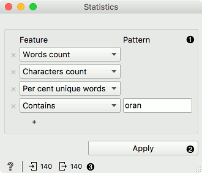
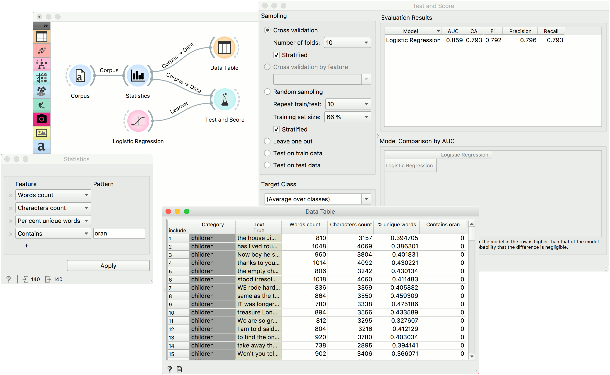

Statistics
==========

Create new statistic variables for documents.

**Inputs**

- Corpus: A collection of documents.

**Outputs**

- Corpus: Corpus with additional attributes.

**Statistics** is a feature constructor widget that adds simple document statistics to a corpus. It supports both standard statistical measures and user-defined variables.

1. Add or remove features. Features can be added with the + sign below. They can be removed with the x sign on the left side. Feature options are:
   - Words count: number of words in the document.
   - Characters count: number of characters in the document.
   - N-grams count: number of n-grams. Define n-grams in [Preprocess Text], otherwise only unigrams will be reported.
   - Average word length: ratio between character count and the number of words
   - Punctuations count: number of punctuations
   - Capitals count: number of capital letters
   - Vowels count: number of vowels. The default is 'a, e, i, o, u', but the user can add her own.
   - Consonants count: number of consonants. Default is given, but the user can adjust it.
   - Per cent unique words: ratio of unique words to all the words (types/tokens).
   - Starts with: number of times a token begins with the specified sequence.
   - Ends with: number of times a token ends with the specified sequence.
   - Contains: number of times a specified sequence is in the token.
   - Regex: number of times the provided regular expression matches the token.
   - POS tag: count specified POS tags. Requires POS tagged tokens from [Preprocess Text](preprocesstext.md). List of Tree POS tags for English can be found [here](https://courses.washington.edu/hypertxt/csar-v02/penntable.html).

2. Press Apply to output corpus with new features.
3. Status line with help on the left and input and output on the right.

Example
-------

Here is a simple example how **Statistics** widget works. As it is a basic feature construction widget, it can be used directly after [Corpus](corpus-widget.md). We have added a couple of features, namely word count, character count, percent unique words and number of words containing 'oran'. We can observe the table with additional columns in a [Data Table](https://orange-visual-programming.readthedocs.io/widgets/data/datatable.html).

We can also use the output of Statistics for predictive modeling with [Test and Score](https://orange-visual-programming.readthedocs.io/widgets/evaluate/testandscore.html). Normally, however, we would use Statistics only to enhance features from the [Bag of Words](bagofwords-widget.md) widget. Some features require POS tagged tokens, which can be created with [Preprocess Text](preprocesstext.md) widget.

