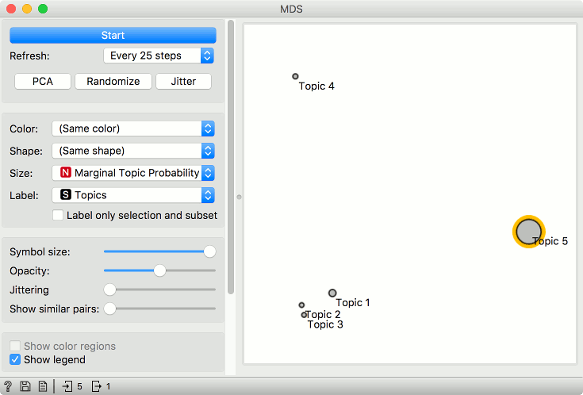
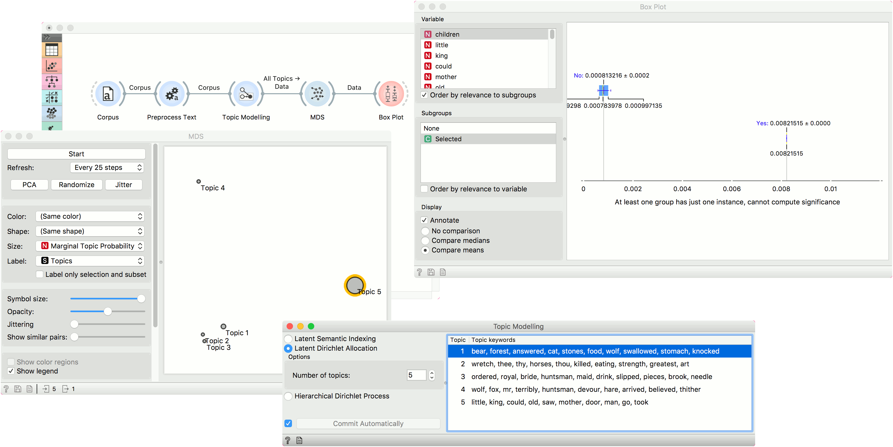

Topic Modelling
===============

Topic modelling with Latent Dirichlet Allocation, Latent Semantic Indexing or Hierarchical Dirichlet Process.

**Inputs**

- Corpus: A collection of documents.

**Outputs**

- Corpus: Corpus with topic weights appended.
- Topics: Selected topics with word weights.
- All Topics: Token weights per topic.

**Topic Modelling** discovers abstract topics in a corpus based on clusters of words found in each document and their respective frequency. A document typically contains multiple topics in different proportions, thus the widget also reports on the topic weight per document.

The widget wraps gensim's topic models ([LSI](https://radimrehurek.com/gensim/models/lsimodel.html), [LDA](https://radimrehurek.com/gensim/models/ldamodel.html), [HDP](https://radimrehurek.com/gensim/models/hdpmodel.html)).

The first, LSI, can return both positive and negative words (words that are in a topic and those that aren't) and concurrently topic weights, that can be positive or negative. As stated by the main gensim's developer, Radim Řehůřek: *"LSI topics are not supposed to make sense; since LSI allows negative numbers, it boils down to delicate cancellations between topics and there's no straightforward way to interpret a topic."*

LDA can be more easily interpreted, but is slower than LSI. HDP has many parameters - the parameter that corresponds to the number of topics is *Top level truncation level (T)*. The smallest number of topics that one can retrieve is 10.

1. Topic modelling algorithm:
   - [Latent Semantic Indexing](https://en.wikipedia.org/wiki/Latent_semantic_analysis). Returns both negative and positive words and topic weights.
   - [Latent Dirichlet Allocation](https://en.wikipedia.org/wiki/Latent_Dirichlet_allocation)
   - [Hierarchical Dirichlet Process](https://en.wikipedia.org/wiki/Hierarchical_Dirichlet_process)
2. Parameters for the algorithm. LSI and LDA accept only the number of topics modelled, with the default set to 10. HDP, however, has more parameters. As this algorithm is computationally very demanding, we recommend you to try it on a subset or set all the required parameters in advance and only then run the algorithm (connect the input to the widget).
   - First level concentration (γ): distribution at the first (corpus) level of Dirichlet Process
   - Second level concentration (α): distribution at the second (document) level of Dirichlet Process
   - The topic Dirichlet (α): concentration parameter used for the topic draws
   - Top level truncation (Τ): corpus-level truncation (no of topics)
   - Second level truncation (Κ): document-level truncation (no of topics)
   - Learning rate (κ): step size
   - Slow down parameter (τ)
3. Produce a report.
4. If *Commit Automatically* is on, changes are communicated automatically. Alternatively press *Commit*.

Examples
--------

#### Exploring Individual Topics

In the first example, we present a simple use of the **Topic Modelling** widget. First we load *grimm-tales-selected.tab* data set and use [Preprocess Text](preprocesstext.md) to tokenize by words only and remove stopwords. Then we connect **Preprocess Text** to **Topic Modelling**, where we use a simple *Latent Semantic Indexing* to find 10 topics in the text.

LSI provides both positive and negative weights per topic. A positive weight means the word is highly representative of a topic, while a negative weight means the word is highly unrepresentative of a topic (the less it occurs in a text, the more likely the topic). Positive words are colored green and negative words are colored red.

We then select the first topic and display the most frequent words in the topic in [Word Cloud](wordcloud.md). We also connected **Preprocess Text** to **Word Cloud** in order to be able to output selected documents. Now we can select a specific word in the word cloud, say *little*. It will be colored red and also highlighted in the word list on the left.

Now we can observe all the documents containing the word *little* in [Corpus Viewer](corpusviewer.md).

#### Topic Visualization

In the second example, we will look at the correlation between topics and words/documents. We are still using the *grimm-tales-selected.tab* corpus. In **Preprocess Text** we are using the default preprocessing, with an additional filter by *document frequency* (0.1 - 0.9). In **Topic Modelling** we are using LDA model with 5 topics.

Connect Topic Modelling to **MDS**. Ensure the link is set to *All Topics* - *Data*. Topic Modelling will output a matrix of word weights by topic.

In MDS, the points are now topics. We have set the size of the points to *Marginal topic probability*, which is an additional columns of *All Topics* - it reports on the marginal probability of the topic in the corpus (how strongly represented is the topic in the corpus).

We can now explore which words are representative for the topic. Select, say, Topic 5 from the plot and connect MDS to **Box Plot**. Make sure the output is set to *Data* - *Data* (not *Selected Data* - *Data*).

In Box Plot, set the subgroup to Selected and check the *Order by relevance to subgroups* box. This option will sort the variables by how well they separate between the selected subgroup values. In our case, this means which words are the most representative for the topic we have selected in the plot (subgroup Yes means selected).

We can see that little, children and kings are the most representative words for Topic 5, with good separation between the word frequency for this topic and all the others. Select other topics in MDS and see how the Box Plot changes.

