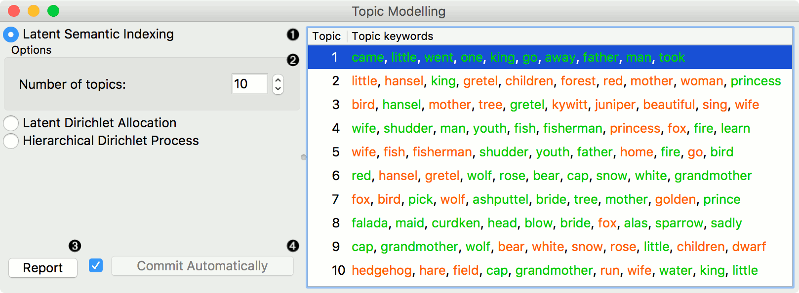
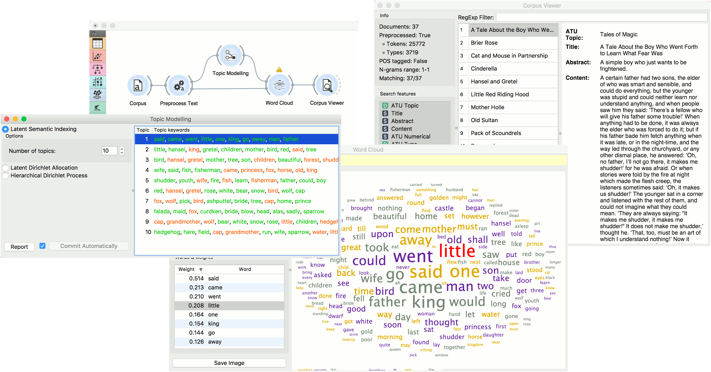
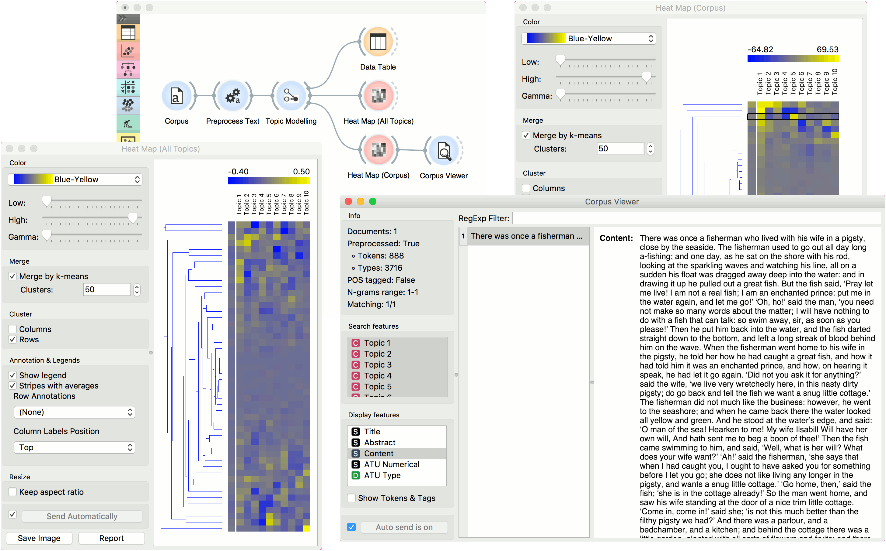

===============
Topic Modelling
===============

Topic modelling with Latent Diriclet Allocation, Latent Semantic Indexing or Hierarchical Dirichlet Process.

Signals
-------

**Inputs**:

-  **Corpus**

Corpus instance.

**Outputs**:

-  **Data**

Data with topic weights appended.

-  **Topics**

Selected topics with word weights.

Description
-----------

**Topic Modelling** discovers abstract topics in a corpus based on clusters of words found in each document and their respective frequency. A document typically contains multiple topics in different proportions, thus the widget also reports on the topic weight per document.

1. Topic modelling algorithm:
	- `Latent Semantic Indexing <https://en.wikipedia.org/wiki/Latent_semantic_analysis>`_
	- `Latent Dirichlet Allocation <https://en.wikipedia.org/wiki/Latent_Dirichlet_allocation>`_
	- `Hierarchical Dirichlet Process <https://en.wikipedia.org/wiki/Hierarchical_Dirichlet_process>`_

2. Parameters for the algorithm. LSI and LDA accept only the number of topics modelled, with the default set to 10. HDP, however, has more parameters. As this algorithm is computationally very demanding, we recommend you to try it on a subset or set all the required parameters in advance and only then run the algorithm (connect the input to the widget).
	- First level concentration (γ): distribution at the first (corpus) level of Dirichlet Process
	- Second level concentration (α): distribution at the second (document) level of Dirichlet Process
	- The topic Dirichlet (α): concentration parameter used for the topic draws
	- Top level truncation (Τ): corpus-level truncation (no of topics)
	- Second level truncation (Κ): document-level truncation (no of topics)
	- Learning rate (κ): step size
	- Slow down parameter (τ)

3. Produce a report.

4. If *Commit Automatically* is on, changes are communicated automatically. Alternatively press *Commit*.

Example
-------

In the first example, we present a simple use of the **Topic Modelling** widget. First we load *bookexcerpts.tab* data set and use :doc:`Preprocess Text <preprocesstext>` to tokenize by words only. Then we connect **Preprocess Text** to **Topic Modelling**, where we use a simple *Latent Semantic Indexing* to find 10 topics in the text.

We then select the first topic and display the most frequent words in the topic in :doc:`Word Cloud <wordcloud>`. We also connected **Preprocess Text** to **Word Cloud** in order to be able to output selected documents. Now we can select a specific word in the word cloud, say *polly*. It will be colored red and also highlighted in the word list on the left.

Now we can observe all the documents containing the word *polly* in :doc:`Corpus Viewer <corpusviewer>`.

The second example will show how to use a more complex schema to find highly relevant words in a topic. We loaded a data set with recent tweets containing words 'Slovenia' and 'Germany'. We've done that with :doc:`Twitter <twitter>` widget and saved it with **Save Data**. Since the data set was very big, we gathered the tweets and saved it to .tab format. Later we can always reload the saved data with :doc:`Corpus <corpus>`.

Then we used :doc:`Preprocess Text <preprocesstext>` to tokenize by words and filter out numbers. Then we have to pass the data through :doc:`Bag of Words <bagofwords>` in order to be able to use the corpus on :doc:`Word Enrichment <wordenrichment>`.

We pass the output of **Bag of Words** to **Topic Modelling**, where we select the first topic for inspection. We can already inspect word frequency of Topic 1 in **Word Cloud**.

Finally, we can use **Select Rows** to retrieve only those documents that have a weight of Topic 1 higher than 0.9 (meaning Topic 1 is represented in more than 9/10 of the document). Finally we connect **Select Rows** and **Bag of Words** to **Word Enrichment**. In **Word Enrichment** we can observe the most significant words in Topic 1.
