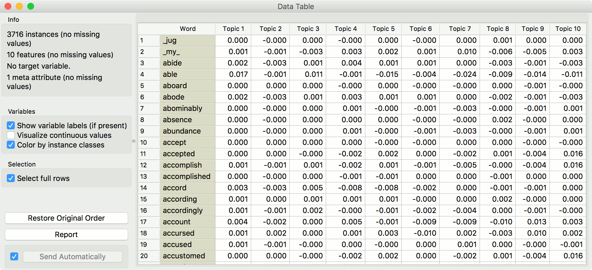

Topic Modelling
===============

Topic modelling with Latent Diriclet Allocation, Latent Semantic Indexing or Hierarchical Dirichlet Process.

Inputs
    Corpus
        A collection of documents.

Outputs
    Corpus
        Corpus with topic weights appended.
    Topics
        Selected topics with word weights.
    All Topics
        Topic weights by tokens.

**Topic Modelling** discovers abstract topics in a corpus based on clusters of words found in each document and their respective frequency. A document typically contains multiple topics in different proportions, thus the widget also reports on the topic weight per document.

.. figure:: images/Topic-Modelling-stamped.png

1. Topic modelling algorithm:
	- `Latent Semantic Indexing <https://en.wikipedia.org/wiki/Latent_semantic_analysis>`_
	- `Latent Dirichlet Allocation <https://en.wikipedia.org/wiki/Latent_Dirichlet_allocation>`_
	- `Hierarchical Dirichlet Process <https://en.wikipedia.org/wiki/Hierarchical_Dirichlet_process>`_

2. Parameters for the algorithm. LSI and LDA accept only the number of topics modelled, with the default set to 10. HDP, however, has more parameters. As this algorithm is computationally very demanding, we recommend you to try it on a subset or set all the required parameters in advance and only then run the algorithm (connect the input to the widget).
	- First level concentration (γ): distribution at the first (corpus) level of Dirichlet Process
	- Second level concentration (α): distribution at the second (document) level of Dirichlet Process
	- The topic Dirichlet (α): concentration parameter used for the topic draws
	- Top level truncation (Τ): corpus-level truncation (no of topics)
	- Second level truncation (Κ): document-level truncation (no of topics)
	- Learning rate (κ): step size
	- Slow down parameter (τ)

3. Produce a report.

4. If *Commit Automatically* is on, changes are communicated automatically. Alternatively press *Commit*.

Example
-------

In the first example, we present a simple use of the **Topic Modelling** widget. First we load *grimm-tales-selected.tab* data set and use :doc:`Preprocess Text <preprocesstext>` to tokenize by words only and remove stopwords. Then we connect **Preprocess Text** to **Topic Modelling**, where we use a simple *Latent Semantic Indexing* to find 10 topics in the text.

.. figure:: images/Topic-Modelling-Example1.png

LSI provides both positive and negative weights per topic. A positive weight means the word is highly representative of a topic, while a negative weight means the word is highly unrepresentative of a topic (the less it occurs in a text, the more likely the topic). Positive words are colored green and negative words are colored red.

We then select the first topic and display the most frequent words in the topic in :doc:`Word Cloud <wordcloud>`. We also connected **Preprocess Text** to **Word Cloud** in order to be able to output selected documents. Now we can select a specific word in the word cloud, say *little*. It will be colored red and also highlighted in the word list on the left.

Now we can observe all the documents containing the word *little* in :doc:`Corpus Viewer <corpusviewer>`.

In the second example, we will look at the correlation between topics and words/documents. Connect **Topic Modelling** to **Heat Map**. Ensure the link is set to *All Topics* - *Data*. **Topic Modelling** will output a matrix of topic weights by words from text (more precisely, tokens).

We can observe the output in a **Data Table**. Tokens are in rows and retrieved topics in colums. Values represent how much a word is represented in a topic.

To visualize this matrix, open **Heat Map**. Select *Merge by k-means* and *Cluster* - *Rows* to merge similar rows into one and sort them by similarity, which makes the visualization more compact.

In the upper part of the visualization, we have words that highly define topics 1-3 and in the lower part those that define topics 5 and 10.

We can similarly observe topic representation across documents. We connect another **Heat Map** to **Topic Modelling** and set link to *Corpus* - *Data*. We set *Merge* and *Cluster* as above.

In this visualization we see how much is a topic represented in a document. Looks like Topic 1 is represented almost across the entire corpus, while other topics are more specific. To observe a specific set of document, select either a clustering node or a row in the visualization. Then pass the data to :doc:`Corpus Viewer <corpusviewer>`.

.. figure:: images/Topic-Modelling-Example2.png