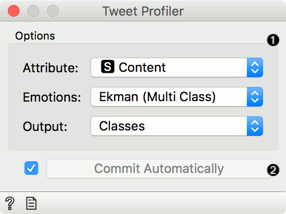
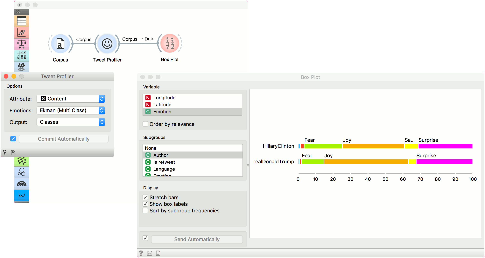

Tweet Profiler
==============

Detect Ekman's, Plutchik's or Profile of Mood States' emotions in tweets.

**Inputs**

- Corpus: A collection of tweets (or other documents).

**Outputs**

- Corpus: A corpus with information on the sentiment of each document.

**Tweet Profiler** retrieves information on sentiment from the server for each given tweet (or document). The widget sends data to the server, where a model computes emotion probabilities and/or scores. The widget support three classifications of emotion, namely [Ekman's](https://en.wikipedia.org/wiki/Paul_Ekman), [Plutchik's](https://en.wikipedia.org/wiki/Robert_Plutchik) and [Profile of Mood States (POMS)](https://en.wikipedia.org/wiki/Profile_of_mood_states).

1. Options:
   - Attribute to use as content.
   - Emotion classification, either Ekman's, Plutchik's or Profile of Mood States. Multi-class will output one most probable emotion per document, while multi-label will output values in columns per each emotion.
   - The widget can output classes of emotion (categorical), probabilities (numeric), or embeddings (an emotional vector of the document).
2. *Commit Automatically* automatically outputs the result. Alternatively, press *Commit*.

Example
-------

We will use *election-tweets-2016.tab* for this example. Load the data with [Corpus](corpus-widget.md) and connect it to **Tweet Profiler**. We will use *Content* attribute for the analysis, Ekman's classification of emotion with multi-class option and we will output the result as class. We will observe the results in a **Box Plot**. In the widget, we have selected to observe the *Emotion* variable, grouped by *Author*. This way we can see which emotion prevails by which author.

References
----------

Colnerič, Niko and Janez Demšar (2018). Emotion Recognition on Twitter: Comparative Study and Training a Unison Model. In IEEE Transactions on Affective Computing. [Available online.](https://ieeexplore.ieee.org/stamp/stamp.jsp?tp=&arnumber=8295234)
