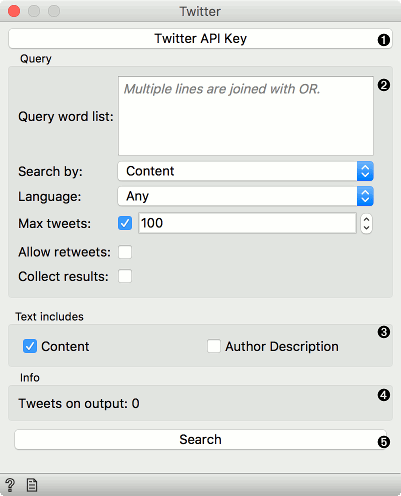
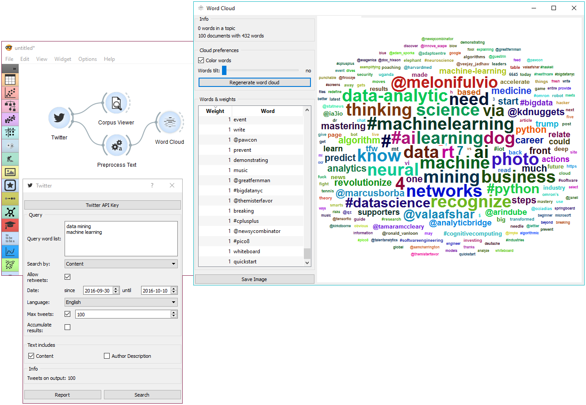
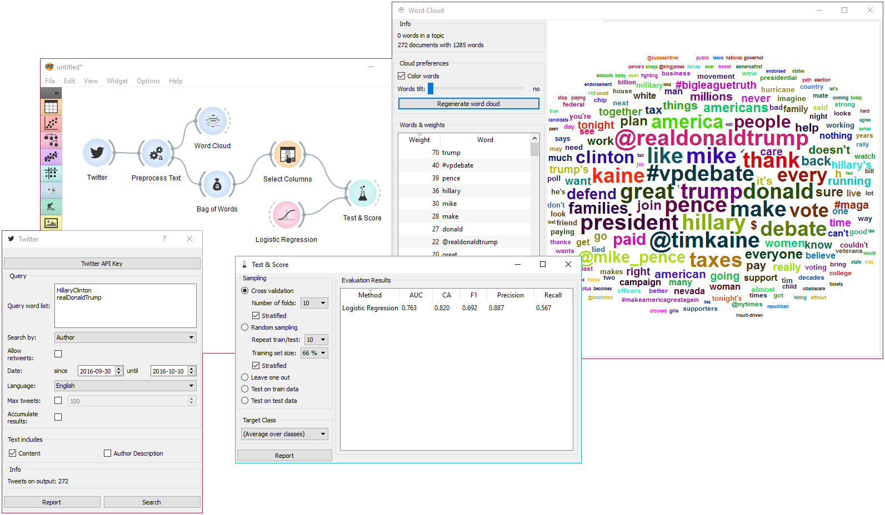

=======
Twitter
======= 

Fetching data from `The Twitter Search API <https://dev.twitter.com/rest/public/search>`_.

Signals
-------

**Inputs**:

-  (None)

**Outputs**:

-  **Corpus**

   A :ref:`Corpus` instance.

Description
-----------

**Twitter** widget enables querying tweets through Twitter API. You can query by content, author or both and  accummulate results should you wish to create a larger data set. The widget only supports REST API and allows queries for up to two weeks back.

1. To begin your queries, insert Twitter key and secret. They are securely saved in your system keyring service (like Credential Vault, Keychain, KWallet, etc.) and won't be deleted when clearing widget settings. You must first create a `Twitter app <https://apps.twitter.com/>`_ to get API keys.

   .. figure:: images/Twitter-key.png

2. Set query parameters:
	- *Query word list*: list desired queries, one per line. Queries are automatically joined by OR.
	- *Search by*: specify whether you want to search by content, author or both. If searching by author, you must enter proper Twitter handle (without @) in the query list.
	- *Allow retweets*: if 'Allow retweets' is checked, retweeted tweets will also appear on the output. This might duplicate some results.
	- *Date*: set the query time frame. Twitter only allows retrieving tweets from up to two weeks back.
	- *Language*: set the language of retrieved tweets. Any will retrieve tweets in any language.
	- *Max tweets*: set the top limit of retrieved tweets. If box is not ticked, no upper bound will be set - widget will retrieve all available tweets.
	- *Accumulate results*: if 'Accumulate results' is ticked, widget will append new queries to the previous ones. Enter new queries, run *Search* and new results will be appended to the previous ones.

3. Define which features to include as text features.

4. Information on the number of tweets on the output.

5. Produce report.

6. Run query.

Examples
--------

First, let's try a simple query. We will search for tweets containing either 'data mining' or 'machine learning' in the content and allow retweets. We will further limit our search to only a 100 tweets in English.

First, we're checking the output in :doc:`Corpus Viewer <corpusviewer>` to get the initial idea about our results. Then we're preprocessing the tweets with lowercase, url removal, tweet tokenizer and removal of stopword and punctuation. The best way to see the results is with :doc:`Word Cloud <wordcloud>`. This will display the most popular words in field of data mining and machine learning in the past two weeks.

Our next example is a bit more complex. We're querying tweets from Hillary Clinton and Donald Trump from the presidential campaign 2016.

Then we've used :doc:`Preprocess Text <preprocesstext>` to get suitable tokens on our output. We've connected **Preprocess Text** to :doc:`Bag of Words <bagofwords>` in order to create a table with words as features and their counts as values. A quick check in **Word Cloud** gives us an idea about the results.

Now we would like to predict the author of the tweet. With **Select Columns** we're setting 'Author' as our target variable. Then we connect **Select Columns** to **Test & Score**. We'll be using **Logistic Regression** as our learner, which we also connect to **Test & Score**.

We can observe the results of our author predictions directly in the widget. AUC score is quite ok. Seems like we can to some extent predict who is the author of the tweet based on the tweet content.
