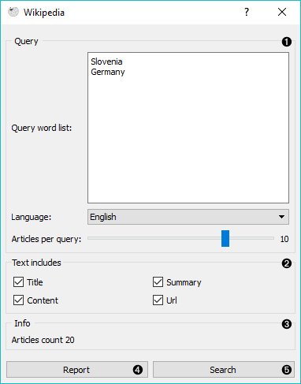
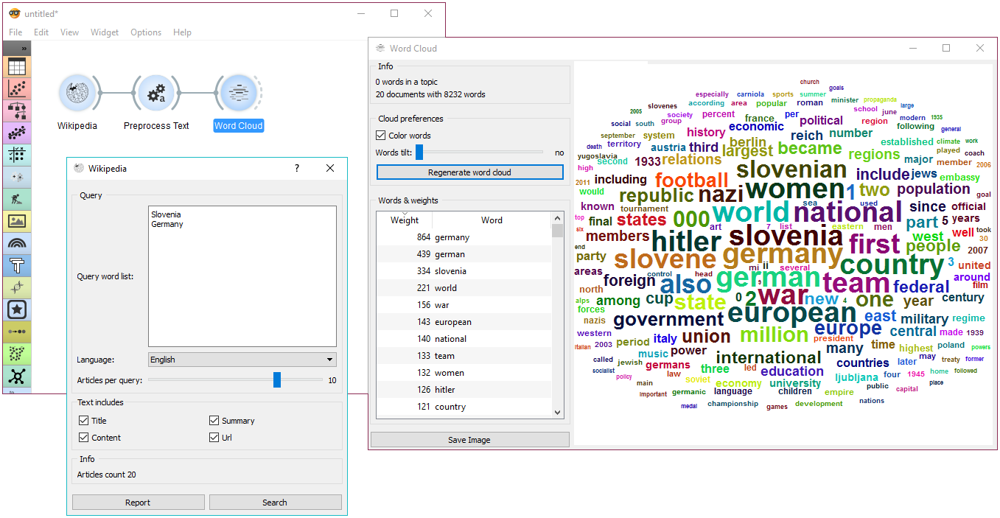

Wikipedia
=========

Fetching data from [MediaWiki RESTful web service API](https://www.mediawiki.org/wiki/API:Tutorial).

**Inputs**

- None

**Outputs**

- Corpus: A collection of documents from the Wikipedia.

**Wikipedia** widget is used to retrieve texts from Wikipedia API and it is useful mostly for teaching and demonstration.

1. Query parameters:
   - Query word list, where each query is listed in a new line.
   - Language of the query. English is set by default.
   - Number of articles to retrieve per query (range 1-25). Please note that querying is done recursively and that disambiguations are also retrieved, sometimes resulting in a larger number of queries than set on the slider.
2. Select which features to include as text features.
3. Information on the output.
4. Produce a report.
5. Run query.

Example
-------

This is a simple example, where we use **Wikipedia** and retrieve the articles on 'Slovenia' and 'Germany'. Then we simply apply default preprocessing with [Preprocess Text](preprocesstext.md) and observe the most frequent words in those articles with [Word Cloud](wordcloud.md).

Wikipedia works just like any other corpus widget ([NY Times](nytimes.md), [Twitter](twitter-widget.md)) and can be used accordingly.
