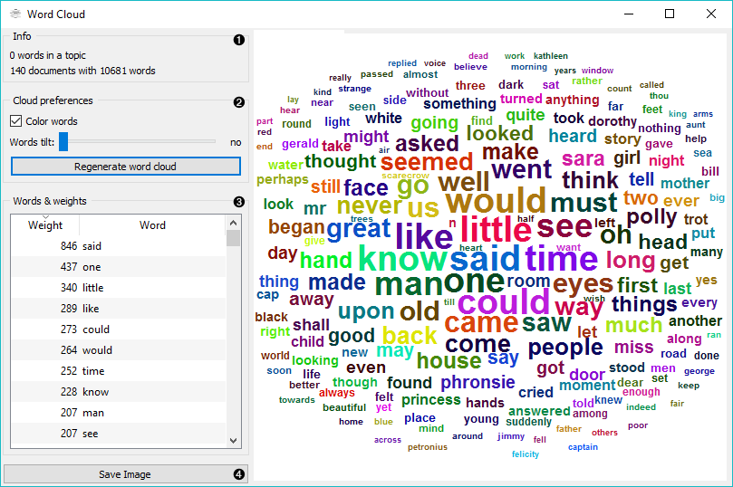
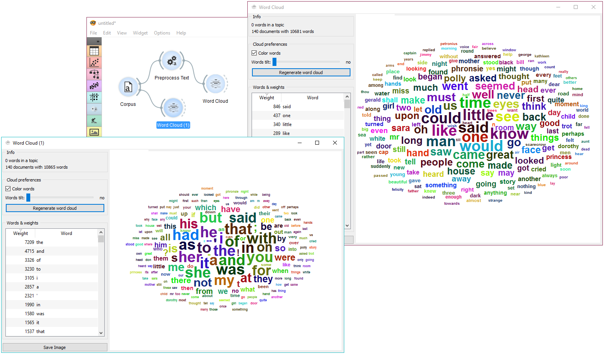

==========
Word Cloud
==========

Generates a word cloud from corpus.

Signals
-------

**Inputs**:

-  **Topic**

   Selected topic.

-  **Corpus**

   A :ref:`Corpus` instance.

**Outputs**:

-  **Corpus**

   Documents that match the selection.

Description
-----------

**Word Cloud** displays tokens in the corpus, their size denoting the frequency of the word in corpus. Words are listed by their frequency (weight) in the widget. The widget outputs documents, containing selected tokens from the word cloud.

1. Information on the input.
	- number of words (tokens) in a topic
	- number of documents and tokens in the corpus

2. Adjust the plot.
	- If *Color words* is ticked, words will be assigned a random color. If unchecked, the words will be black.
	- *Word tilt* adjust the tilt of words. The current state of tilt is displayed next to the slider ('no' is the default).
	- *Regenerate word cloud* plot the cloud anew.

3. Words & weights displays a sorted list of words (tokens) by their frequency in the corpus or topic. Clicking on a word will select that same word in the cloud and output matching documents. Use *Ctrl* to select more than one word. Documents matching ANY of the selected words will be on the output (logical OR).

4. *Save Image* saves the image to your computer in a .svg or .png format.

Example
-------

**Word Cloud** is an excellent widget for displaying the current state of the corpus and for monitoring the effects of preprocessing.

Use :doc:`Corpus <corpus>` to load the data. Connect :doc:`Preprocess Text <preprocesstext>` to it and set your parameters. We've used defaults here, just to see the difference between the default preprocessing in the **Word Cloud** widget and the **Preprocess Text** widget.

We can see from the two widgets, that **Preprocess Text** displays only words, while default preprocessing in the **Word Cloud** tokenizes by word and punctuation.
