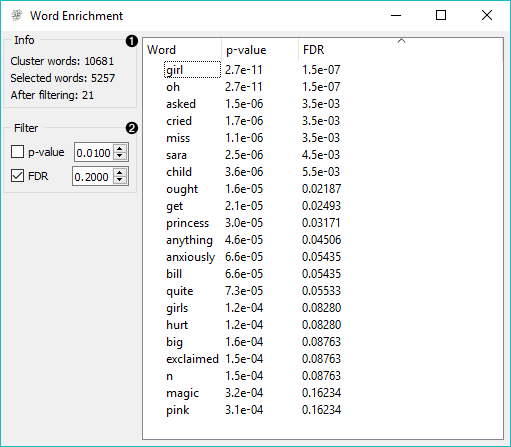
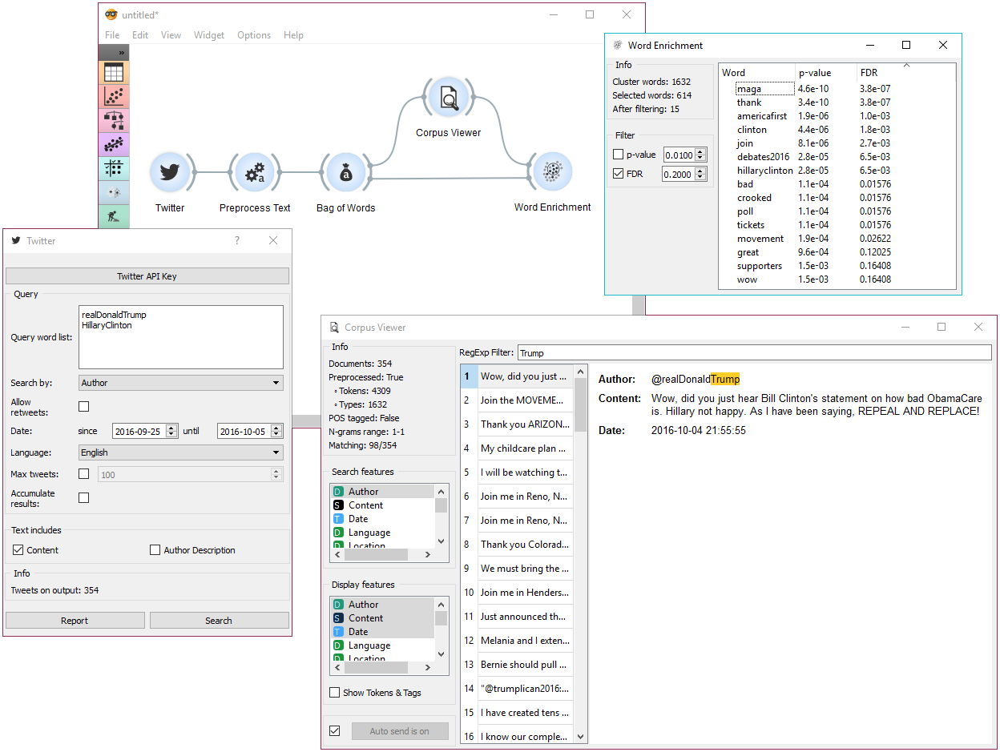

Word Enrichment
===============

Word enrichment analysis for selected documents.

**Inputs**

- Corpus: A collection of documents.
- Selected Data: Selected instances from corpus.

**Outputs**

- None

**Word Enrichment** displays a list of words with lower p-values (higher significance) for a selected subset compared to the entire corpus. Lower p-value indicates a higher likelihood that the word is significant for the selected subset (not randomly occurring in a text). FDR (False Discovery Rate) is linked to p-value and reports on the expected percent of false predictions in the set of predictions, meaning it account for false positives in list of low p-values.

1. Information on the input.
   - Cluster words are all the tokens from the corpus.
   - Selected words are all the tokens from the selected subset.
   - After filtering reports on the enriched words found in the subset.
2. Filter enables you to filter by:
   - [p-value](https://en.wikipedia.org/wiki/P-value)
   - [false discovery rate (FDR)](http://www.nonlinear.com/support/progenesis/comet/faq/v2.0/pq-values.aspx)

Example
-------

In the example below, we're retrieved recent tweets from the 2016 presidential candidates, Donald Trump and Hillary Clinton. Then we've preprocessed the tweets to get only words as tokens and to remove the stopwords. We've connected the preprocessed corpus to [Bag of Words](bagofwords-widget.md) to get a table with word counts for our corpus.

Then we've connected [Corpus Viewer](corpusviewer.md) to **Bag of Words** and selected only those tweets that were published by Donald Trump. See how we marked only the *Author* as our *Search feature* to retrieve those tweets.

**Word Enrichment** accepts two inputs - the entire corpus to serve as a reference and a selected subset from the corpus to do the enrichment on. First connect **Corpus Viewer** to **Word Enrichment** (input Matching Docs → Selected Data) and then connect **Bag of Words** to it (input Corpus → Data). In the **Word Enrichment** widget we can see the list of words that are more significant for Donald Trump than they are for Hillary Clinton.
