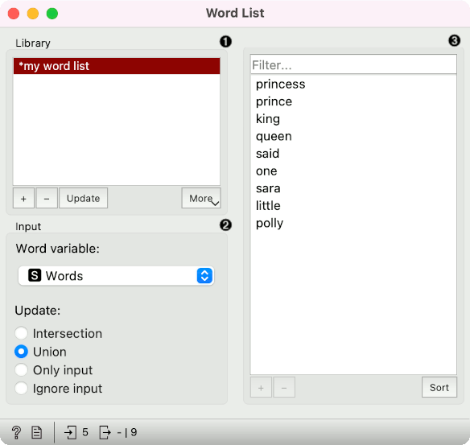
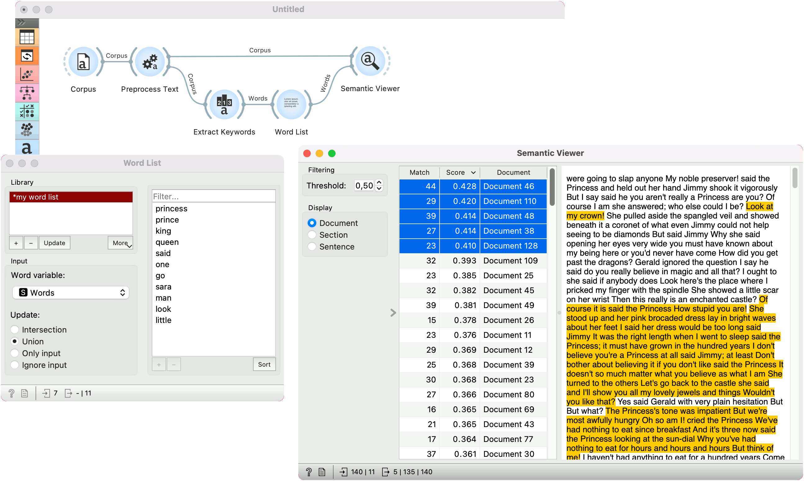

Word List
=========

Create a list of words.

**Inputs**

- Words: A table of words.

**Outputs**

- Selected Words: Words selected from the table.
- Words: A table of words.

**Word List** is meant for creating and joining lists of words for semantic analysis. The user can manually enter words into the widget or import them from other widgets, for example [Extract Keywords](keywords.md).

1. Library of existing word lists. Add a new list with a "+" or remove it with "-". Use "Update" to save the current list from the right as a word list in the widget. With "More" you can load an existing list in a .txt format using the *Import Words from File* option or save the list locally using the *Save Words to File*.
2. Input options:
   - Word variable: set which string variable to use as a list of words.
   - Update: define how to use an existing list and the input Words. *Intersection* will use only overlapping words, *Union* will use all the words, *Only input* will ignore the list from the widget and use only the input list and *Ignore input* will use only the list from the widget.
3. Use *Filter* to find a word from the list. The list shows the words on the output. One can select a subset of words from the list. Use "+" to add a new word and "-" to remove it from the list. *Sort* will sort the list alphabetically.

Example
-------

In this example we are using the pre-loaded *book-excerpts* corpus from the [Corpus](corpus-widget.md) widget. [Preprocess Text](preprocesstext.md) creates tokens by transforming the text to lowercase, splitting it into words, normalizing the words with Lemmagen lemmatizer and finally removing stopwords.

Then we pass the preprocessed data to [Extract Keywords](keywords.md), a widget that finds characteristic words in the corpus. We have used the default TF-IDF setting and passed the top 7 words (said, one, go, sara, man, look, little) to Word List.

In the Word List, we have previously defined some words that we would like to find in the text, namely princess, prince, king, queen. We have used *Union* to keep both the list we have manually defined and the one we have input from the Extract Keywords.

Finally, we send the entire word list to [Semantic Viewer](semanticviewer.md) and add the *Corpus* output from Preprocess Text as well. Semantic Viewer now scores documents based on the input word list. The higher the score, the more matches the document has.

This is a nice way to find a content of interest (say princes and princesses) in a collection of texts.

